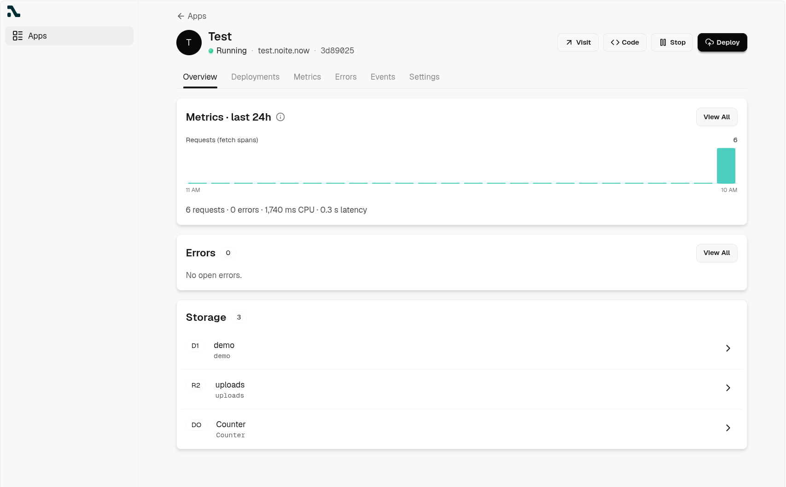
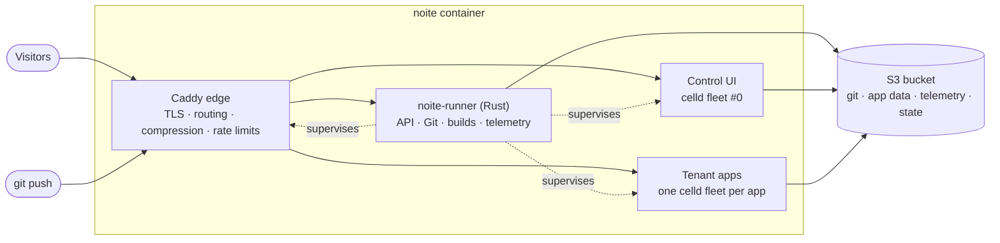

<div align="center">

<a href="https://noite.now"></a>

# Noite

**The app platform you own.**

A tiny, self-hostable PaaS for [celld](https://celld.dev) apps: `git push` deploys, with Durable Objects, SQL databases and object storage included.<br /> One command installs it, one image runs it, and your data lives in a bucket you own.

<a href="https://github.com/ryuzcorp/noite/actions/workflows/ci.yml"></a> <a href="https://github.com/ryuzcorp/noite/tags"></a> <a href="https://github.com/ryuzcorp/noite/pkgs/container/noite"></a> <a href="LICENSE"></a> <a href="https://discord.gg/WnVTMCTz74"></a>

**[Docs](https://noite.now/introduction/)** · **[Quickstart](https://noite.now/quickstart/)** · **[How it works](https://noite.now/how-it-works/)** · **[Changelog](CHANGELOG.md)** · **[Discord](https://discord.gg/WnVTMCTz74)**

<br />



</div>

---

> [!IMPORTANT]
>
> Noite is in **alpha**. It runs real apps, but read the [known limits](https://noite.now/self-hosting/known-limits/) before you invite people you would not give shell access to a shared server. Upgrades are announced in the [changelog](CHANGELOG.md), each with an "Operator action required" section.

```bash
curl -fsSL https://noite.now/run.sh | bash -s install
```

<sub>Ubuntu or Debian · amd64 or arm64 · 2 GB of RAM · no domain needed to try it</sub>

## Why Noite

- **Own the whole stack.** Your server, your bucket, your bill. Noite is open source (Apache-2.0); you pay for a VPS and storage, nothing else.
- **Bring your Workers app.** Many Cloudflare Workers apps move over as they are: deploy with the `wrangler.jsonc` you already have. Durable Objects, D1, R2, KV, Queues, Workflows, Cron and static assets run on celld ([supported APIs](https://celld.dev/docs/)).
- **`git push` and it's live.** Every push to `main` installs, builds, runs your release command and deploys to `https://<slug>.<your-domain>`.
- **Scale to zero.** Apps idle for a day go to sleep and free their memory. The next request waits a few seconds while the app wakes, then is served normally: no splash page, no dropped request.
- **One bucket holds everything.** Git history, app storage and Noite's own state live in one S3 bucket. Lose the server and a fresh install restores itself from it.
- **Built to share.** Invite-only sign-up with passkeys, per-app roles, and a sandbox for other people's code.

## Quickstart

### On a server

On a fresh Ubuntu or Debian server with ports 80 and 443 free:

```bash
curl -fsSL https://noite.now/run.sh | bash -s install
```

The installer asks for a base domain (press Enter to use `<server-ip>.sslip.io`, which needs no DNS), installs Docker if missing, generates secrets into `/opt/noite/.env`, and waits until Noite is ready. Re-run it to upgrade. Then open `https://app.<domain>` and register: **the first account becomes the admin**.

### On your machine

```bash
curl -fsSLO https://raw.githubusercontent.com/ryuzcorp/noite/main/docker/compose.yaml
docker compose up -d
```

Open http://localhost:9080. Apps are served at `http://<slug>.localhost:9080`.

### Deploy your first app

Create an app (for example `hello`) and an API key in the UI, then:

```bash
mkdir hello && cd hello
cat > wrangler.jsonc <<'EOF'
{ "name": "hello", "main": "index.js", "compatibility_date": "2026-09-01" }
EOF
echo 'export default { fetch: () => new Response("Hello from Noite") };' > index.js

git init -b main && git add -A && git commit -m "first deploy"
git remote add origin "https://git:<api-key>@git.<domain>/hello"
git push -u origin main
# → https://hello.<domain>
```

The full walkthrough is in the [Quickstart](https://noite.now/quickstart/).

## Features

|  |  |
| --- | --- |
| 🚀 **Deploys** | `git push` to `main`, Vite/Rsbuild/Wrangler builds with npm, pnpm, Yarn or Bun, release commands for migrations, and [one-click rollback](https://noite.now/apps/deploy/) to any earlier deploy. |
| 🤖 **CI deploys** | `bunx @noitenow/cli deploy` ships a prebuilt `dist/` from GitHub Actions and comments the URL on your pull request ([CLI](https://noite.now/reference/cli/)). |
| 📈 **Observability** | Live logs, metrics over 24 h, 7 d or 30 d (requests, errors, latency, CPU), slow-request spans and error tracking for every app, with no collector to run ([Observe](https://noite.now/apps/observe/)). |
| 🗄️ **Data browser** | Browse each app's D1 tables, R2 objects and Durable Objects from the dashboard. |
| 🌐 **Domains & TLS** | Automatic `<slug>.<domain>` subdomains and custom domains, with certificates issued on demand. No wildcard certificate or DNS API needed. |
| 🔐 **Accounts** | Passkey sign-in, invite-only registration, and per-app `view`, `push` and `admin` roles for teammates. |
| 🛡️ **Tenant sandbox** | In multi-tenant mode, builds and apps run as unprivileged users behind an egress firewall, away from the platform's secrets and internal network ([Tenancy](https://noite.now/self-hosting/tenancy/)). |
| 🧱 **Edge protection** | Per-client, Git and per-app rate limits, with your own overrides and Cloudflare in front if you want it ([Protection](https://noite.now/self-hosting/protection/)). |
| 💾 **Operations** | Health checks (`/ready`, `make doctor`), backups and restore, release channels, and a recovery code for a lost passkey ([Operations](https://noite.now/self-hosting/operations/)). |

## Install it your way

| Where | How |
| --- | --- |
| **Any VPS** | `curl -fsSL https://noite.now/run.sh \| bash -s install` ([Install](https://noite.now/self-hosting/install/)) |
| **Docker Compose** | `docker compose -f docker/compose.yaml up -d`: every variable has a default |
| **Coolify** | A Docker Compose resource pointed at this repo ([Platforms](https://noite.now/self-hosting/platforms/)) |
| **Railway** | One service from the image, a volume at `/data`, and a bucket ([Platforms](https://noite.now/self-hosting/platforms/)) |

Installs follow a release channel: `ghcr.io/ryuzcorp/noite:alpha` by default. `stable` follows final releases only, and a version tag (`0.1.0-alpha.2`) pins one release. For real installs, bring your own S3-compatible bucket (R2, S3, Tigris, GCS or Azure Blob); the bundled RustFS store is for getting started ([Storage](https://noite.now/self-hosting/storage/)).

Installs send one anonymous heartbeat a day — release, platform and counts, never domains, names, emails or IPs. It is opt-out: the Admin section on `/account` or `NOITE_TELEMETRY=0` turns it off ([Telemetry](https://noite.now/self-hosting/telemetry/)).

## How it works

Noite ships as **one image**. The runner is PID 1 and supervises everything else:



- **Runner** ([`apps/runner`](apps/runner)): Git smart-HTTP, builds, deploys, the API, telemetry aggregation with DuckDB, and the edge configuration. Its SQLite state is snapshotted into the bucket.
- **Caddy**: TLS with on-demand certificates, host routing, compression and rate limits, configured by the runner through its admin API.
- **Control UI** ([`apps/noite`](apps/noite)): an [Oxide](https://github.com/ryuzcorp/oxide) Worker served by its own celld node.
- **Tenant apps**: one celld fleet per app, run as an unprivileged user, put to sleep when idle and woken by the next request.

More in [How it works](https://noite.now/how-it-works/) and [SPEC.md](SPEC.md).

## Development

You need Docker or Podman with Compose, and `make`.

```bash
cp .env.example .env
make up       # build the image from the tree and start
make dev      # cargo-watch runner + vite dev control UI, sources bind-mounted
make logs
make doctor   # codified health checks
make e2e      # image + doctor + Playwright; make e2e-isolation for multi-tenant
make help     # everything else: backup, restore, down, nuke
```

| URL                            |               |
| ------------------------------ | ------------- |
| http://localhost:9080          | control UI    |
| http://api.localhost:9080      | runner API    |
| `http://<slug>.localhost:9080` | deployed apps |

| Path |  |
| --- | --- |
| [`apps/runner`](apps/runner) | Rust runner: deploys, fleets, edge config, telemetry, supervision |
| [`apps/noite`](apps/noite) | Oxide control UI |
| [`apps/noite/test`](apps/noite/test) | sample apps and the hostile-tenant isolation probe |
| [`apps/website`](apps/website) | [noite.now](https://noite.now) and the docs |
| [`packages/cli`](packages/cli) | `@noitenow/cli`, deploys from CI |
| [`docker/`](docker) | the Dockerfile, Compose files and the installer |

[AGENTS.md](AGENTS.md) holds the repo conventions, [SPEC.md](SPEC.md) the design record, and [ROADMAP.md](ROADMAP.md) the roadmap and design history. Run `bun x ultracite fix` before committing.

<details>
<summary><strong>Passkeys on a phone over the LAN</strong></summary>

Phones can't use passkeys over `http://<lan-ip>:9080` (not a secure context), and `*.localhost` resolves to the phone itself. Serve the dev stack as `https://noite.local` with [portless](https://github.com/vercel-labs/portless) LAN mode instead.

One-time setup (`:443` needs sudo):

```bash
npm install -g portless
portless alias noite 9080 # the route lives in ~/.portless and survives restarts
sudo firewall-cmd --permanent --add-service=https && sudo firewall-cmd --reload
```

Set `BETTER_AUTH_URL=https://noite.local` in `.env`. Passkeys bind to that origin, so the laptop and the phone share one credential namespace; with the `.env.example` default (`http://localhost:9080`), a phone registering on `noite.local` fails with an rpID mismatch. In dev, `vite dev` passes the container's environment to the worker, so `.env` is the only source needed (a hand-written `apps/noite/.dev.vars` still overrides it).

Per boot:

```bash
CONTROL_EXTRA_HOSTS=noite.local make dev-host # route noite.local to the control UI
portless proxy start --lan --https            # https://noite.local (accept sudo)
```

On the phone, install `~/.portless/ca.pem` as a trusted CA (iOS: open the file, install the profile, enable full trust; Android: Security → install CA certificate), open `https://noite.local`, and register a **fresh** passkey: `localhost` credentials never transfer. Android often can't resolve mDNS `.local` names; iOS works. `portless list` shows routes and `portless proxy stop` stops the proxy.

Tenant apps work the same way: with `CONTROL_EXTRA_HOSTS=noite.local` the runner also serves `<slug>.noite.local`, and one alias per app wires DNS on both machines:

```bash
portless alias test.noite 9080 # → https://test.noite.local
```

</details>

## Documentation

- [Introduction](https://noite.now/introduction/) and [Quickstart](https://noite.now/quickstart/)
- **Apps:** [deploy](https://noite.now/apps/deploy/), [build](https://noite.now/apps/build/), [configure](https://noite.now/apps/configure/), [observe](https://noite.now/apps/observe/)
- **Self-hosting:** [install](https://noite.now/self-hosting/install/), [storage](https://noite.now/self-hosting/storage/), [tenancy](https://noite.now/self-hosting/tenancy/), [platforms](https://noite.now/self-hosting/platforms/), [operations](https://noite.now/self-hosting/operations/), [known limits](https://noite.now/self-hosting/known-limits/)
- **Reference:** [API](https://noite.now/reference/api/), [CLI](https://noite.now/reference/cli/), [environment variables](https://noite.now/reference/environment-variables/), [limits](https://noite.now/reference/limits/)

## Community and support

- [Discord](https://discord.gg/WnVTMCTz74) for questions and help
- [GitHub Issues](https://github.com/ryuzcorp/noite/issues) for bugs and feature requests
- [SECURITY.md](SECURITY.md) to report a vulnerability privately

## License

[Apache-2.0](LICENSE). Noite runs apps on [celld](https://celld.dev) by Deno, also Apache-2.0.
