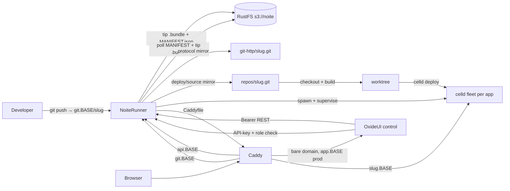

# Noite: tiny self-hostable Celld PaaS

## Decisions (locked)

- **Product:** full tiny PaaS — user accounts, apps, subdomains, thin deploy/build logs + status
- **Tenancy:** single-operator Compose install; no orgs; users own apps; per-app collaborators (`view` / `push` / `admin`)
- **Control plane:** **Oxide Worker UI on a celld fleet** (`preset: worker` — real workflows/queues/cron, D1 auth DB) + **Rust runner** (fleet supervisor + Caddyfile owner; stays a container, a Rust binary can't be a worker)
- **Tenant runtime:** each app is its own celld fleet (prefix + keys)
- **Source:** stock Git smart-HTTP at `http://git.$BASE_DOMAIN/{slug}` (Basic `git` / profile API key; collaborator `view`/`push`) → runner writes tip `s3://noite/git/{slug}/refs/heads/main/{sha}.bundle` + a `MANIFEST.json` linearization point
- **Deploy:** push to `main` (and/or tip poll / webhook) → bare mirror + checkout → build → `celld deploy` → reload
- **Isolation:** one app = one fleet; never share `deploy/current.json`
- **Edge:** Caddy — control on bare `$BASE_DOMAIN` locally (`https://app.noite.now` in prod via `CONTROL_SUBDOMAIN=app`) + `api.` + `git.` + `{app}.$BASE_DOMAIN` (prod `https://{app}.noite.now`; `app`/`api`/`git` slugs reserved) Behind a terminating proxy (Coolify), `CADDY_AUTO_HTTPS=off` and our Caddy terminates per-host TLS itself via on-demand certs (runner ask-gated at `/v1/edge/tls-ask`; Traefik TCP-forwards SNI); see `docker/compose.coolify.yaml`.
- **Effect:** prefer `Effect` / `Config` / `Schedule` / `Schema` / `HttpClient` / `Layer` over ad-hoc async

## Status (2026-09-15)

Working end-to-end on rootless Podman Compose (repo root).

### Done

| Area | Notes |
| --- | --- |
| Compose stack | `rustfs`, `runner`, `ui`, `caddy` — `docker/compose.yaml` (Compose files live under `docker/`) |
| Ports | Host **9080/9443**; control `http://localhost:9080`; API `http://api.localhost:9080`; apps `http://{slug}.localhost:9080` |
| Runner | **Rust** (`apps/runner`) — deploy, fleets, caddy; ensures the single `NOITE_S3_BUCKET` bucket on boot |
| Control UI | **Oxide worker fleet** (`apps/noite`, `preset: worker`) — passkeys + actions proxying to runner; D1 (`DB` binding) replaces `bun:sqlite`, OTP email via `NOITE_EMAIL_WEBHOOK_URL` webhook (no SMTP sockets on workers), `bun-durable` shim deleted |
| Deploy pipeline | Tip `.bundle` → bare repo + worktree → optional bun scripts → `celld deploy` → spawn/reload |
| Deploy trigger | push fast-path (spawn) + reconcile tip poll of `MANIFEST.json` + main `.bundle` + `/webhook` bearer-gated nudge — RustFS notify off |
| Edge | Caddy; preserve `Host` / forwarded headers |
| Source preview | per-app file tree + code / last-push diff — `@pierre/trees` + `@pierre/diffs` (vanilla) · runner `{tree,blob,diff}` endpoints read the bare mirror |
| Observability | per-app requests / latency from **celld OTel** (`CELLD_OTEL=1` → Parquet spans in the fleet bucket, aggregated by the runner with DuckDB) + CPU ms (celld process sampling) → minute buckets (`app_metric`) → detail-page 24h chart — the pricing substrate |
| Sample app | `apps/noite/test/` + `deploy.sh` (Git HTTP → tip bundle) |
| Git hardening | `MANIFEST.json` linearization per slug, receive-pack head parsing, per-role push policy (`push` = create + fast-forward only, `admin` = anything), per-slug push mutex, manifest re-apply on reads (`git_policy.rs`/`git_manifest.rs`); `app`/`api`/`git` slugs reserved |

### Control fleet cutover runbook (UI → celld fleet)

Topology decision (2026-09-18): control plane runs split — Rust runner and control celld node in separate containers, one image each. UI versions deploy via `celld deploy` with zero restarts (runner and tenant fleets never bounce), and each side keeps its own logs. The pre-worker joint Bun image (`Dockerfile.control`, `noite-prod.sh`, `dist/server.js` via srvx) is retired — Bun cannot serve the worker build. End state is one image runnable both ways (per-service command for split compose, supervisor default for single-container GHCR/Coolify); until reliability settles, split stays canonical locally.

Status: executed up to the compose flip. `s3://noite/control` holds the worker (final prod vars) + live D1 `noite-control` (migrated, empty — fresh start, old SQLite deleted). Verified on a temp node: `/health` 200, `/login` 200 shell (needs the explicit `assets.binding: ASSETS` — celld does not auto-inject it), `/api/auth/get-session` 200, cron/queue/workflow cells ticking, zero node errors. Remaining: `make up`, then sign up fresh (step 7).

Fresh start (2026-09-18): no data migration — D1 starts empty, old SQLite files deleted, `ui-data` volume dropped. Everyone re-registers; passkeys/keys are recreated. The fleet must still serve the same control URL (`BETTER_AUTH_URL` unchanged) so RP ID stays valid for the new credentials.

Steps:

1. Provision D1 (`wrangler d1 create noite-control` or celld equivalent) and fill `database_id` in `apps/noite/wrangler.jsonc`.
2. Import the sqlite dump into D1; verify tables (`user`, `session`, `account`, `verification`, `passkey`, `apikey`, `app`, …).
3. Set secrets on the fleet (`BETTER_AUTH_SECRET` unchanged, `RUNNER_TOKEN`, AWS/RUSTFS keys, `NOITE_ADMIN_EMAIL`, `NOITE_EMAIL_WEBHOOK_URL`; `BETTER_AUTH_URL` = the same control URL).
4. `celld deploy dist` from `apps/noite` (uses the oxide-prepared `dist/wrangler.json`).
5. Flip `CADDY_CONTROL_UPSTREAM` from `ui:8080` to the fleet origin URL and recreate caddy (`reverse_proxy` accepts a full URL).
6. Retire local joint serving (`docker/compose.dev-joint.yaml` + `noite-joint-dev.sh` deleted); the single-container joint image (`docker/noite-joint.sh` via `railpack.json`) stays for Coolify/GHCR only. Image rebuilds happen inline via `up`/`dev --build`, no separate build targets.
7. Sign up fresh on the fleet UI and verify apps/keys/passkeys end to end.

Dev loop: `make dev` runs the same 4 services as prod with dev processes — runner cargo-watch, control as `vite dev` (full Oxide + Cloudflare plugin pipeline: workerd, local D1, HMR). No bucket, no deploy cycle. (`celld dev` cannot serve this app: raw esbuild can't resolve `virtual:oxide/worker`.) Secrets from `.dev.vars`. Never run dev and prod stacks at once (shared names/volumes).

### Left / polish

- Release command + releases/rollback (built 2026-09-19) — `release` from tenant `wrangler.jsonc` runs once post-build with tenant+AWS env, abort keeps old release serving; `POST /v1/apps/{id}/rollback {sha}` redeploys a past success sha; UI rollback button on success rows
- Revert via S3 native versioning (built 2026-09-19) — `put-bucket-versioning` at boot, best-effort for BYOB keys; revert stays a sha redeploy (bundles immutable per-sha)
- Tenant secrets on the Cloudflare model (built 2026-09-19) — `app_env` table + `/v1/apps/{id}/env` CRUD (admin-gated writes), injected into build/release/fleet env with `AWS_/*S3_/*CELLD_*/PORT/HOST` denylist; `.dev.vars` download in settings; local dev stays the tenant's own file
- Doctor diagnostics (built 2026-09-19) — `make doctor` runs `docker/doctor.sh`: stack up, runner healthy + reconciled, API auth, rustfs live, control UI serving
- CLI (`packages/cli`, `@noitenow/cli`) — Effect CLI `noite deploy`: CI-built dist + `wrangler.jsonc` pushed as a synthetic commit over Git smart-HTTP (Basic `git` + API key, `push`-gated, always fast-forward); reads `GITHUB_*` context in Actions, writes `$GITHUB_OUTPUT`, PR comments via `gh` (no GitHub App). Full REST CLI still deferred until the surface stabilizes.
- RustFS webhooks unreliable — poll is the reliable path; `/webhook` stays as an optional bearer-gated nudge for `deploy.sh`
- Tiny forge UI over bare mirrors (`RUNNER_WORK_DIR/repos/{slug}.git`) — source preview (W4) started this; full history / commit views remain
- Source preview polish: hydrated expand-unchanged context (`loadDiffFiles`), per-file permalinks
- TLS / real domains (plan: `https://app.noite.now` control via `CONTROL_SUBDOMAIN=app`, `https://{slug}.noite.now` apps)
- Ops (backups, quotas, APM)
- Scoped per-app RustFS keys: the Bun host plane that minted them is deleted (W1.3); Git auth is profile API keys (Better Auth) + collaborator checks via runner → UI `/internal/git-auth`

## Source preview (W4) — 2026-09-12

"Code preview of the latest code pushed to the git bucket, per app."

- [x] **Runner endpoints** (`apps/runner/src/host/source.rs`) — `GET /v1/apps/{id}/tree` (paths + sizes), `/{id}/blob/{*path}` (256 KB cap, binary detect), `/{id}/diff` (parent diff; `--root` for the initial push; 1 MB cap) — all served from the persistent bare mirror `repos/{slug}.git`, rev = `last_deploy_sha` else HEAD; browser never sees the runner token (server actions)
- [x] **UI actions** — `sourceTree` / `sourceBlob` / `sourceDiff` in `apps.server.tsx` (ownership-gated)
- [x] **Browser** — `/apps/[id]/source` page + `lib/source-browser.tsx`: `@pierre/trees` vanilla `FileTree` (presorted prepared input, search) in the sidebar; `@pierre/diffs` vanilla `File` for the code pane and `FileDiff` per changed file (via `parsePatchFiles`) for the last-push diff; mounts are imperative inside `watch.once()` so ilha reruns never repatch the mounted hosts (dynamic `import()` keeps SSR clean)
- [ ] **Hydration** — wire `loadDiffFiles` (blob@parent / blob@HEAD) so patch diffs can expand unchanged context; needs a rev parameter on the blob endpoint

## Observability (W5) — via celld telemetry

"Basic stats per app: requests received + CPU time celld executes — pricing-ready." Implemented as directed: use celld.dev/docs/telemetry rather than edge logs.

- [x] **Enable fleet telemetry** — `CELLD_OTEL=1` + `CELLD_OTEL_FLUSH_MS=10000` + `CELLD_OTEL_RETENTION=14d` in `supervisor.rs`; celld (bucket sink) writes Parquet spans to `s3://noite/fleets/{slug}/telemetry/traces/<node>/<yyyy>/<mm>/<dd>/<hh>/…` — no collector service
- [x] **Requests + latency** — runner (every ~10 s) runs the DuckDB CLI against that glob: `strftime('%Y-%m-%dT%H:%M:00Z', to_timestamp(start_unix_us/1000000))` per-minute buckets, incremental watermark 5 s behind the 2 s flush (closed minutes ⇒ never double-counts); **only `celld.fetch` spans count as requests** (verified 1:1 against traffic — the docs' schema is `node,region,trace_id,span_id,parent_span_id,name,kind,start_unix_us,duration_us,ok,error,request_id,cell,epoch,isolate,queue_wait_us,url,http_status,parent_remote`); no-files errors (fresh app) are skipped, real failures are logged
- [x] **CPU time celld executes** — spans carry durations only (no metrics signal yet in celld), so CPU stays on `/proc/<celld-pid>/stat` subtree sampling (utime+stime deltas, descendants via `task/*/children`); the runner spawns celld, so /proc is visible
- [x] **Errors** — from the trace `ok` flag (no more invented zeros): `sum(CASE WHEN NOT ok THEN 1 ELSE 0 END)` per minute
- [x] **What the fleet is doing** — `GET /v1/apps/{id}/spans?hours=1` (on-demand DuckDB, read at page load, not stored): top spans by name/kind with counts, exec ms, failed spans, and the **queue wait** (`queue_wait_us`) celld records
- [x] **Persistence** — `app_metric` minute buckets (upsert-accumulate), 14-day prune
- [x] **API + UI** — `GET /v1/apps/{id}/metrics?hours=24` (bearer-gated) · `MetricsCard` on the app page: 24×1 h bars (requests, CPU ms) + totals + a **Spans · last hour** table (name · n · ms · err · queued) fed by `/spans`
- [ ] **Pricing** — bill on requests + `duration_us` (span wall time incl. queue wait — the closest pricing-compute signal celld exposes today) and/or `cpu_ms`; `errors` stays 0 (trace schema has no status)
- [ ] **Later** — run the docs' compaction job before shortening flush windows at scale; a future celld metrics signal may also expose true CPU

## Plan (2026-09-12)

Ordered by payoff. Each item: what · why · files. W1 is mechanical and safe; W2 is hardening; W3 is structural. Oxide/Effect showcase code (schedules, queues, workflows, liveQuery, the `sync-apps` mirror) is **kept deliberately** — this PaaS doubles as a framework showcase (creator decision). The retired Bun host plane (`apps/noite/src/host/*`, `lib/store.ts`) was deleted outright during cleanup.

### Wave 1 — quick wins (mechanical) — done

- [x] **W1.1 Root `.dockerignore`** · kills the 2.5 GB build context (1.5 GB `target/`, `node_modules`, `dist`, `.wrangler`, `data`) · `+.dockerignore`
- [x] **W1.2 `make down` preserves data** · was `down -v --remove-orphans` (nuked runner SQLite, git mirrors, control DB, caddy config) · `down` = plain down; new explicit `nuke` = down -v + local `.wrangler` miniflare state · `Makefile` (+ `.pi-lens.json` so the repo linter's shellcheck-in-bash-mode stops mis-parsing make conditionals; Makefile `ifneq`/exports use shell-safe quoted + `$(or $(and …))` forms)
- [x] **W1.3 Legacy worker UI deleted** · `docker/ui.sh` + `apps/noite/ui/` were the pre-Oxide celld worker control UI (`s3://fleets/_control`), superseded by Oxide · deleted, dir and bucket documented as legacy. **Deleted during cleanup:** `apps/noite/src/host/*`, `lib/store.ts` — retired Oxide/Effect host plane (nothing imported it; Rust runner is the host)
- [x] **W1.4 Caddyfile single owner** · compose bootstrap + `docker/noite.sh` seed raced the runner's rewrite · both deleted; caddy only creates an empty file if missing; runner `caddy::rewrite_caddy` owns all routes. Trade-off: on a fresh volume, control/api routes appear once the runner's first reconcile writes the file (rustfs ready, ~≤60 s worst case) instead of instantly

### Wave 2 — hardening — done (W2.5 partial)

- [x] **W2.1 `/webhook` bearer-gated** · `auth.rs` allows only `/health` without a token · UI proxy (`routes.ts`) and `deploy.sh` nudge send `authorization: Bearer $RUNNER_TOKEN` · RustFS notify **disabled** in compose (it cannot carry a bearer header; poll + deploy.sh nudge are the triggers — SPEC already treated poll as authoritative)
- [x] **W2.2 Default secrets refused off-localhost** · `BASE_DOMAIN != localhost` with `BETTER_AUTH_SECRET`/`RUNNER_TOKEN` still at shipped defaults ⇒ boot fails with a message · guards in `docker/noite-joint.sh` (joint/Coolify image) + runner `config.rs` (dev runs on localhost, no gate needed)
- [x] **W2.3 Deploy log capped at 64 KB tail** · `db.rs::upsert_deploy` no longer grows unbounded
- [x] **W2.4 Git credentials** · Profile API keys (Better Auth); runner verifies via UI + collaborator role (`view` fetch / `push` receive)
- [x] **W2.5 Graceful stops** · `stop_grace_period: 30s/15s` on runner/ui. **Deferred:** rustfs `healthcheck:` + `depends_on: service_healthy` — the rustfs image's tooling couldn't be verified from this environment (no container engine); runner already blocks on readiness at boot

### Wave 3 — structural

- [x] **W3.1 Immutable UI image (joint era, superseded by the split topology above)** · prod no longer bind-mounts source and `bun install` + `vite build` per boot; `docker/Dockerfile.control` baked deps + dist at `docker build` time (immutable, no npm at runtime) · entrypoint `docker/noite-prod.sh` (secret gate + start) · prod compose ui = image + `ui-data` only · dev (`make dev`) still uses the tools image + bind mount + `docker/noite.sh` HMR — see `docker/compose.dev.yaml`
- [ ] **W3.2 UI DB mirror consolidation — deferred, showcase** · the UI keeps its own `app`/`app_secret`/`deploy` copy + 1-min `sync-apps` schedule + `runner-op` queue/workflow + liveQuery topics mirroring the runner. The runner is already the source of truth behind a bearer-gated REST API and single-writer SQLite; consolidating would remove the mirror + drift at the cost of deleting the Oxide schedule/queue/workflow showcase. **Kept deliberately** (creator decision) — revisit only if the dual-write actually bites

Acceptance: `make up` cold build < 30 s · Git-HTTP push → app live ≤ poll + build · `make down` preserves `agent-data` · no legacy `_control` worker image.

## Architecture



### Buckets

- `s3://noite/git/{appSlug}/` — tip bundles from Git HTTP (or legacy git-remote-s3) + `MANIFEST.json` (`{seq, refs}`; readers resolve refs from the manifest so half-written pushes stay invisible)
- `s3://noite/fleets/{appSlug}/` — tenant celld
- Legacy `s3://fleets/_control/` worker UI bucket is gone (W1.3); control serves the bare domain locally
- Runner ensures bucket `NOITE_S3_BUCKET` (default `noite`) on boot; uses root keys for deploy/reconcile
- One rustfs bucket, two prefixes — not separate `git` / `fleets` buckets

### Process model

| Process  | Role                                                  |
| -------- | ----------------------------------------------------- |
| `rustfs` | S3 (notify disabled; runner polls + `/webhook` nudge) |
| `runner` | REST API, deploy, caddy rewrite, spawn tenant celld   |
| `ui`     | Oxide control UI (server-side proxy to runner)        |
| `caddy`  | subdomains on host ports 9080/9443                    |

## Compose UX

```bash
cp .env.example .env
make up
./apps/noite/test/deploy.sh   # sample push via Git HTTP → deploy
```

Infra: `docker/compose.yaml`, `docker/`, `Makefile` at repo root.

## Out of scope for v1

- Organizations / multi-host
- Deep APM
- Custom domains beyond `*.BASE_DOMAIN`
- Non-`celld deploy` workloads
