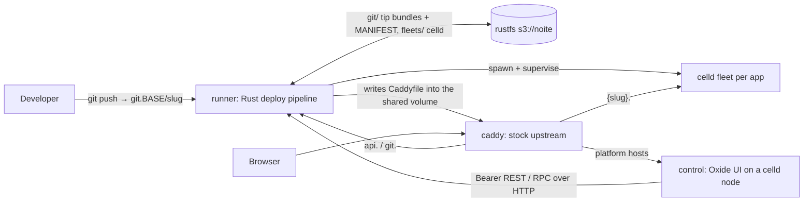

# Noite: tiny self-hostable Celld PaaS

## Decisions (locked)

> **Partly superseded 2026-09-24:** the control-plane and edge bullets below describe the retired container-cell topology (RunnerContainer DO, static Caddyfile, container mode). Current topology: see [Topology revert to compose mode](#topology-revert-to-compose-mode-2026-09-24) at the bottom.

- **Product:** full tiny PaaS — user accounts, apps, subdomains, thin deploy/build logs + status
- **Tenancy:** single-operator Compose install; no orgs; users own apps; per-app collaborators (`view` / `push` / `admin`)
- **Control plane:** **Oxide Worker UI on a celld fleet** (`preset: worker` — real workflows/queues/cron, D1 auth DB) + **Rust runner as the `noite-control` container cell** (`RunnerContainer` DO, singleton `standard-4`, image `docker/Dockerfile.runner`; a Rust binary can't be a worker). The worker DO owns host→port routing; the Caddyfile is static.
- **Tenant runtime:** each app is its own celld fleet (prefix + keys)
- **Source:** stock Git smart-HTTP at `http://git.$BASE_DOMAIN/{slug}` (Basic `git` / profile API key; collaborator `view`/`push`) → runner writes tip `s3://noite/git/{slug}/refs/heads/main/{sha}.bundle` + a `MANIFEST.json` linearization point
- **Deploy:** push to `main` (and/or tip poll / webhook) → bare mirror + checkout → build → `celld deploy` → reload
- **Isolation:** one app = one fleet; never share `deploy/current.json`
- **Edge:** Caddy (static file) — wildcard site + on-demand TLS (ask-gated at `/v1/edge/tls-ask` via the control worker) + `reverse_proxy control:8090` for everything; the worker Host-dispatches to control UI (`CONTROL_SUBDOMAIN=app` in prod, bare domain in dev) + `api.` + `git.` + `{app}.$BASE_DOMAIN` (prod `https://{app}.noite.now`; `app`/`api`/`git` slugs reserved) through `RunnerContainer.getTcpPort(port)`. Behind a terminating proxy (Coolify/Traefik TCP-forwards SNI) our Caddy still terminates per-host TLS itself via on-demand certs; Coolify uses the same universal `docker/compose.yaml` with env overrides (Traefik labels for the tenant TCP service are in the file).
- **Effect:** prefer `Effect` / `Config` / `Schedule` / `Schema` / `HttpClient` / `Layer` over ad-hoc async

## Status (2026-09-15)

> **Historical (superseded 2026-09-24):** the rows below describe the container-cell cutover, the loopback S3 sidecar and the R2 durability relay. See [Topology revert to compose mode](#topology-revert-to-compose-mode-2026-09-24).

Working end-to-end on rootless Podman Compose (repo root).

### Done

| Area | Notes |
| --- | --- |
| Compose stack | `rustfs`, `control`, `caddy` — `docker/compose.yaml` (Compose files live under `docker/`) |
| Ports | Host **9080/9443**; control `http://localhost:9080`; API `http://api.localhost:9080`; apps `http://{slug}.localhost:9080` |
| Runner | **Rust** (`apps/runner`) — deploy, fleets, route table; loopback S3 sidecar in container mode (fence blocks the compose store) with worker-relayed R2 durability; SQLite snapshot restores from the sidecar, bare mirrors rehydrate from tip bundles; ensures the single `NOITE_S3_BUCKET` bucket on boot |
| Control UI | **Oxide worker fleet** (`apps/noite`, `preset: worker`) — passkeys + actions proxying to runner; D1 (`DB` binding) replaces `bun:sqlite`, OTP email via `NOITE_EMAIL_WEBHOOK_URL` webhook (no SMTP sockets on workers), `bun-durable` shim deleted |
| Deploy pipeline | Tip `.bundle` → bare repo + worktree → optional bun scripts → `celld deploy` → spawn/reload |
| Deploy trigger | push fast-path (spawn) + reconcile tip poll of `MANIFEST.json` + main `.bundle` + `/webhook` bearer-gated nudge — RustFS notify off |
| Edge | Caddy; preserve `Host` / forwarded headers |
| Source preview | per-app file tree + code / last-push diff — `@pierre/trees` + `@pierre/diffs` (vanilla) · runner `{tree,blob,diff}` endpoints read the bare mirror |
| Observability | per-app requests / latency from **celld OTel** (`CELLD_OTEL=1` → Parquet spans in the fleet bucket, aggregated by the runner with DuckDB) + CPU ms (celld process sampling) → minute buckets (`app_metric`) → detail-page 24h chart — the pricing substrate |
| Sample app | `apps/noite/test/` + `deploy.sh` (Git HTTP → tip bundle) |
| Git hardening | `MANIFEST.json` linearization per slug, receive-pack head parsing, per-role push policy (`push` = create + fast-forward only, `admin` = anything), per-slug push mutex, manifest re-apply on reads (`git_policy.rs`/`git_manifest.rs`); `app`/`api`/`git` slugs reserved |

### Control fleet cutover runbook (UI → celld fleet)

> **Historical (superseded 2026-09-24):** kept as a record of the container-cell cutover; the runbook steps no longer apply. See [Topology revert to compose mode](#topology-revert-to-compose-mode-2026-09-24).

Topology decision (2026-09-18): control plane runs split — Rust runner and control celld node in separate containers, one image each. UI versions deploy via `celld deploy` with zero restarts (runner and tenant fleets never bounce), and each side keeps its own logs. The pre-worker joint Bun image (`Dockerfile.control`, `noite-prod.sh`, `dist/server.js` via srvx) is retired — Bun cannot serve the worker build. End state is one image runnable both ways (per-service command for split compose, supervisor default for single-container GHCR/Coolify); until reliability settles, split stays canonical locally.

Status: executed up to the compose flip. `s3://noite/control` holds the worker (final prod vars) + live D1 `noite-control` (migrated, empty — fresh start, old SQLite deleted). Verified on a temp node: `/health` 200, `/login` 200 shell (needs the explicit `assets.binding: ASSETS` — celld does not auto-inject it), `/api/auth/get-session` 200, cron/queue/workflow cells ticking, zero node errors. Remaining: `make up`, then sign up fresh (step 7).

Fresh start (2026-09-18): no data migration — D1 starts empty, old SQLite files deleted, `ui-data` volume dropped. Everyone re-registers; passkeys/keys are recreated. The fleet must still serve the same control URL (`BETTER_AUTH_URL` unchanged) so RP ID stays valid for the new credentials.

Steps:

1. Provision D1 (`wrangler d1 create noite-control` or celld equivalent) and fill `database_id` in `apps/noite/wrangler.jsonc`.
2. Import the sqlite dump into D1; verify tables (`user`, `session`, `account`, `verification`, `passkey`, `apikey`, `app`, …).
3. Set secrets on the fleet (`BETTER_AUTH_SECRET` unchanged, `RUNNER_TOKEN`, AWS/RUSTFS keys, `NOITE_ADMIN_EMAIL`, `NOITE_EMAIL_WEBHOOK_URL`; `BETTER_AUTH_URL` = the same control URL).
4. `celld deploy dist` from `apps/noite` (uses the oxide-prepared `dist/wrangler.json`).
5. Flip `CADDY_CONTROL_UPSTREAM` from `ui:8080` to the fleet origin URL and recreate caddy (`reverse_proxy` accepts a full URL).
6. Single runner image (`docker/Dockerfile.runner` — compose `control`, the `celld deploy` container cell, and the railpack CI build all use it); the joint supervisor (`docker/noite-joint.sh`, `docker/compose.coolify.yaml`) is deleted, Coolify deploys the universal `docker/compose.yaml` with env overrides. Image rebuilds happen inline via `up`/`dev --build`, no separate build targets.
7. Sign up fresh on the fleet UI and verify apps/keys/passkeys end to end.

Dev loop: `make dev` runs the 4-service dev layout with dev processes — runner cargo-watch, control as `vite dev` (full Oxide + Cloudflare plugin pipeline: workerd, local D1, HMR). No bucket, no deploy cycle. (`celld dev` cannot serve this app: raw esbuild can't resolve `virtual:oxide/worker`.) Secrets from `.dev.vars`. Never run dev and prod stacks at once (shared names/volumes).

### Left / polish

- Release command + releases/rollback (built 2026-09-19) — `release` from tenant `wrangler.jsonc` runs once post-build with tenant+AWS env, abort keeps old release serving; `POST /v1/apps/{id}/rollback {sha}` redeploys a past success sha; UI rollback button on success rows
- Revert via S3 native versioning (built 2026-09-19) — `put-bucket-versioning` at boot, best-effort for BYOB keys; revert stays a sha redeploy (bundles immutable per-sha)
- Tenant secrets on the Cloudflare model (built 2026-09-19) — `app_env` table + `/v1/apps/{id}/env` CRUD (admin-gated writes), injected into build/release/fleet env with `AWS_/*S3_/*CELLD_*/PORT/HOST` denylist; `.dev.vars` download in settings; local dev stays the tenant's own file
- Doctor diagnostics (built 2026-09-19) — `make doctor` runs `docker/doctor.sh`: stack up, runner healthy + reconciled, API auth, rustfs live, control UI serving
- CLI (`packages/cli`, `@noitenow/cli`) — Effect CLI `noite deploy`: CI-built dist + `wrangler.jsonc` pushed as a synthetic commit over Git smart-HTTP (Basic `git` + API key, `push`-gated, always fast-forward); reads `GITHUB_*` context in Actions, writes `$GITHUB_OUTPUT`, PR comments via `gh` (no GitHub App). Full REST CLI still deferred until the surface stabilizes.
- RustFS webhooks unreliable — poll is the reliable path; `/webhook` stays as an optional bearer-gated nudge for `deploy.sh`
- Tiny forge UI over bare mirrors (`RUNNER_WORK_DIR/repos/{slug}.git`) — source preview (W4) started this; full history / commit views remain
- Source preview polish: hydrated expand-unchanged context (`loadDiffFiles`), per-file permalinks
- TLS / real domains (plan: `https://app.noite.now` control via `CONTROL_SUBDOMAIN=app`, `https://{slug}.noite.now` apps)
- Ops (quotas, APM) — backups built 2026-09-23: nightly `runner-backup` cron copies the telemetry keyspace (the only state the 5-min R2 relay skips) to `backup/<date>/`, 7-day retention, explicit `POST /__do/restore?date=` recovery
- Scoped per-app RustFS keys: the Bun host plane that minted them is deleted (W1.3); Git auth is profile API keys (Better Auth) + collaborator checks via runner → UI `/internal/git-auth`

## Source preview (W4) — 2026-09-12

"Code preview of the latest code pushed to the git bucket, per app."

- [x] **Runner endpoints** (`apps/runner/src/host/source.rs`) — `GET /v1/apps/{id}/tree` (paths + sizes), `/{id}/blob/{*path}` (256 KB cap, binary detect), `/{id}/diff` (parent diff; `--root` for the initial push; 1 MB cap) — all served from the persistent bare mirror `repos/{slug}.git`, rev = `last_deploy_sha` else HEAD; browser never sees the runner token (server actions)
- [x] **UI actions** — `sourceTree` / `sourceBlob` / `sourceDiff` in `apps.server.tsx` (ownership-gated)
- [x] **Browser** — `/apps/[id]/source` page + `lib/source-browser.tsx`: `@pierre/trees` vanilla `FileTree` (presorted prepared input, search) in the sidebar; `@pierre/diffs` vanilla `File` for the code pane and `FileDiff` per changed file (via `parsePatchFiles`) for the last-push diff; mounts are imperative inside `watch.once()` so ilha reruns never repatch the mounted hosts (dynamic `import()` keeps SSR clean)
- [ ] **Hydration** — wire `loadDiffFiles` (blob@parent / blob@HEAD) so patch diffs can expand unchanged context; needs a rev parameter on the blob endpoint

## Observability (W5) — via celld telemetry

"Basic stats per app: requests received + CPU time celld executes — pricing-ready." Implemented as directed: use celld.dev/docs/telemetry rather than edge logs.

- [x] **Enable fleet telemetry** — `CELLD_OTEL=1` + `CELLD_OTEL_FLUSH_MS=10000` + `CELLD_OTEL_RETENTION=14d` in `supervisor.rs`; celld (bucket sink) writes Parquet spans to `s3://noite/fleets/{slug}/telemetry/traces/<node>/<yyyy>/<mm>/<dd>/<hh>/…` — no collector service
- [x] **Requests + latency** — runner (every ~10 s) runs the DuckDB CLI against that glob: `strftime('%Y-%m-%dT%H:%M:00Z', to_timestamp(start_unix_us/1000000))` per-minute buckets, incremental watermark 5 s behind the 2 s flush (closed minutes ⇒ never double-counts); **only `celld.fetch` spans count as requests** (verified 1:1 against traffic — the docs' schema is `node,region,trace_id,span_id,parent_span_id,name,kind,start_unix_us,duration_us,ok,error,request_id,cell,epoch,isolate,queue_wait_us,url,http_status,parent_remote`); no-files errors (fresh app) are skipped, real failures are logged
- [x] **CPU time celld executes** — spans carry durations only (no metrics signal yet in celld), so CPU stays on `/proc/<celld-pid>/stat` subtree sampling (utime+stime deltas, descendants via `task/*/children`); the runner spawns celld, so /proc is visible
- [x] **Errors** — from the trace `ok` flag (no more invented zeros): `sum(CASE WHEN NOT ok THEN 1 ELSE 0 END)` per minute
- [x] **What the fleet is doing** — `GET /v1/apps/{id}/spans?hours=1` (on-demand DuckDB, read at page load, not stored): top spans by name/kind with counts, exec ms, failed spans, and the **queue wait** (`queue_wait_us`) celld records
- [x] **Persistence** — `app_metric` minute buckets (upsert-accumulate), 14-day prune
- [x] **API + UI** — `GET /v1/apps/{id}/metrics?hours=24` (bearer-gated) · `MetricsCard` on the app page: 24×1 h bars (requests, CPU ms) + totals + a **Spans · last hour** table (name · n · ms · err · queued) fed by `/spans`
- [ ] **Pricing** — bill on requests + `duration_us` (span wall time incl. queue wait — the closest pricing-compute signal celld exposes today) and/or `cpu_ms`; `errors` stays 0 (trace schema has no status)
- [ ] **Later** — run the docs' compaction job before shortening flush windows at scale; a future celld metrics signal may also expose true CPU

## Plan (2026-09-12)

> **Historical:** this plan shipped; its volume names and container-cell details predate the 2026-09-24 revert — see [Topology revert to compose mode](#topology-revert-to-compose-mode-2026-09-24).

Ordered by payoff. Each item: what · why · files. W1 is mechanical and safe; W2 is hardening; W3 is structural. Oxide/Effect showcase code (schedules, queues, workflows, liveQuery, the `sync-apps` mirror) is **kept deliberately** — this PaaS doubles as a framework showcase (creator decision). The retired Bun host plane (`apps/noite/src/host/*`, `lib/store.ts`) was deleted outright during cleanup.

### Wave 1 — quick wins (mechanical) — done

- [x] **W1.1 Root `.dockerignore`** · kills the 2.5 GB build context (1.5 GB `target/`, `node_modules`, `dist`, `.wrangler`, `data`) · `+.dockerignore`
- [x] **W1.2 `make down` preserves data** · was `down -v --remove-orphans` (nuked runner SQLite, git mirrors, control DB, caddy config) · `down` = plain down; new explicit `nuke` = down -v + local `.wrangler` miniflare state · `Makefile` (+ `.pi-lens.json` so the repo linter's shellcheck-in-bash-mode stops mis-parsing make conditionals; Makefile `ifneq`/exports use shell-safe quoted + `$(or $(and …))` forms)
- [x] **W1.2b `nuke` really wipes every database** · reported: after `make nuke`, `apps.create` answered `409 slug already taken`. Cause: podman-compose's `down -v` exits on the first container it cannot find and never reaches its volume loop, so a stopped stack kept `runner-data` (the runner's SQLite → every app row) and `rustfs-data` (bucket: git mirrors, fleets, and the control D1 with accounts/invites). `nuke` now removes `<project>_*` and `noite-e2e_*` volumes by name after the three `down`s, and the e2e line merges the base file so the lane's volumes are known. Verified: nuke → `apps: []`, `/api/invite/status` `firstRun: true`, re-creating the old slug → 201, creating it twice → 409 · `Makefile`, docs
- [x] **W1.3 Legacy worker UI deleted** · `docker/ui.sh` + `apps/noite/ui/` were the pre-Oxide celld worker control UI (`s3://fleets/_control`), superseded by Oxide · deleted, dir and bucket documented as legacy. **Deleted during cleanup:** `apps/noite/src/host/*`, `lib/store.ts` — retired Oxide/Effect host plane (nothing imported it; Rust runner is the host)
- [x] **W1.4 Caddyfile single owner** · compose bootstrap + `docker/noite.sh` seed raced the runner's rewrite · both deleted; caddy only creates an empty file if missing; runner `caddy::rewrite_caddy` owns all routes. Trade-off: on a fresh volume, control/api routes appear once the runner's first reconcile writes the file (rustfs ready, ~≤60 s worst case) instead of instantly

### Wave 2 — hardening — done (W2.5 partial)

- [x] **W2.1 `/webhook` bearer-gated** · `auth.rs` allows only `/health` without a token · UI proxy (`routes.ts`) and `deploy.sh` nudge send `authorization: Bearer $RUNNER_TOKEN` · RustFS notify **disabled** in compose (it cannot carry a bearer header; poll + deploy.sh nudge are the triggers — SPEC already treated poll as authoritative)
- [x] **W2.2 Default secrets refused off-localhost** · `BASE_DOMAIN != localhost` with `BETTER_AUTH_SECRET`/`RUNNER_TOKEN` still at shipped defaults ⇒ boot fails with a message · guards in worker `auth.ts` (`defaultSecretRefusal` on first auth construction — the worker entry is virtual, no boot hook) + runner `config.rs` (dev runs on localhost, no gate needed)
- [x] **W2.3 Deploy log capped at 64 KB tail** · `db.rs::upsert_deploy` no longer grows unbounded
- [x] **W2.4 Git credentials** · Profile API keys (Better Auth); runner verifies via UI + collaborator role (`view` fetch / `push` receive)
- [x] **W2.6 Runner release image renamed to `noite-runner`** · was `ghcr.io/<owner>/noite`, ambiguous next to `noite-control` and easy to confuse with the repo/bundle names · workflow push target + merge matrix, `make up-prod` default, `.env.example`, `docker/e2e-local.sh` (`TAG=<sha>` pulls), backup/restore helper fallbacks, README + deployment docs · **Migration:** installs that pin `NOITE_RUNNER_IMAGE=ghcr.io/<owner>/noite:<tag>` keep working off the old package's last tags but stop receiving updates — switch to `noite-runner`. A new package name is a new GHCR package: check its visibility/linkage matches the old one before anonymous hosts pull it
- [x] **W2.7 Docker artifacts all under `docker/`** · `Dockerfile.runner-container` (root) → `docker/Dockerfile.runner`; each image gets its own `<Dockerfile>.dockerignore` (Docker/BuildKit resolves it next to the Dockerfile and it wins over a context-root `.dockerignore`; verified on podman/buildah too), so no `Dockerfile*` / `.dockerignore` / `compose*` sits outside `docker/` — `apps/noite/.dockerignore` and `apps/runner/.dockerignore` were dead context files and are gone. **Behavior fix found while moving:** a bare pattern matches the context root only, so the old `target`/`node_modules`/`dist` lines never excluded `apps/runner/target` (≈2.5 GB) or the nested `node_modules` trees from the repo-root context — the guards are now `**/target`, `**/node_modules`, `**/dist`, … The dev images (`runner-dev`, `tools`) COPY only `docker/install-sidecars.sh`, so their guards are `*` + explicit negations (a few KB of context instead of the whole tree)
- [x] **W2.5 Graceful stops** · `stop_grace_period: 30s/15s` on runner/ui. **Deferred:** rustfs `healthcheck:` + `depends_on: service_healthy` — the rustfs image's tooling couldn't be verified from this environment (no container engine); runner already blocks on readiness at boot

### Wave 3 — structural

- [x] **W3.1 Immutable UI image (joint era, superseded by the split topology above)** · prod no longer bind-mounts source and `bun install` + `vite build` per boot; `docker/Dockerfile.control` baked deps + dist at `docker build` time (immutable, no npm at runtime) · entrypoint `docker/noite-prod.sh` (secret gate + start) · prod compose ui = image + `ui-data` only · dev (`make dev`) still uses the tools image + bind mount + `docker/noite.sh` HMR — see `docker/compose.dev.yaml`
- [ ] **W3.2 UI DB mirror consolidation — deferred, showcase** · the UI keeps its own `app`/`app_secret`/`deploy` copy + 1-min `sync-apps` schedule + `runner-op` queue/workflow + liveQuery topics mirroring the runner. The runner is already the source of truth behind a bearer-gated REST API and single-writer SQLite; consolidating would remove the mirror + drift at the cost of deleting the Oxide schedule/queue/workflow showcase. **Kept deliberately** (creator decision) — revisit only if the dual-write actually bites
  - **Superseded 2026-09-24:** the mirror was retired — the UI reads the runner API directly. See [Topology revert to compose mode](#topology-revert-to-compose-mode-2026-09-24).

Acceptance: `make up` cold build < 30 s · Git-HTTP push → app live ≤ poll + build · `make down` preserves `agent-data` · no legacy `_control` worker image.

## Architecture



### Buckets

- `s3://noite/git/{appSlug}/` — tip bundles from Git HTTP + `MANIFEST.json` (`{seq, refs}`; readers resolve refs from the manifest so half-written pushes stay invisible)
- `s3://noite/fleets/{appSlug}/` — tenant celld
- `s3://noite/control/` — the UI worker bundle + its D1 (the `control-state` volume is the celld node's local working dir, not durable state)
- Runner state — SQLite, git mirrors, builds — lives in the `runner-data` volume, the only copy of deploy metadata; the fleet bucket is the other durable half (`rustfs-data`)
- Runner ensures bucket `NOITE_S3_BUCKET` (default `noite`) on boot; uses root keys for deploy/reconcile
- One rustfs bucket, three prefixes — not separate `git` / `fleets` buckets

### Process model

| Process | Role |
| --- | --- |
| `rustfs` | S3 (bundled, or external via the BYOB overlay) |
| `runner` | Rust deploy pipeline, tenant celld fleets, Caddyfile, telemetry aggregation |
| `control` | Oxide control UI on a celld node; the image bakes the worker bundle and self-deploys it on boot |
| `caddy` | stock upstream edge on host ports 9080/9443 — `api.`/`git.` → runner, platform hosts → control, `{slug}.` → tenant ports |

## Compose UX

```bash
cp .env.example .env
make up
./apps/noite/test/deploy.sh   # sample push via Git HTTP → deploy
```

Infra: `docker/compose.yaml`, `docker/`, `Makefile` at repo root.

## Out of scope for v1

- Organizations / multi-host
- Deep APM
- Custom domains beyond `*.BASE_DOMAIN`
- Workloads that aren't celld apps

## Topology revert to compose mode (2026-09-24)

Decision: the container-cell topology is retired. Noite installs as a plain four-service Compose stack from `docker/compose.yaml` — `rustfs`, `runner`, `control`, `caddy` — and `docker compose up -d` is the whole install.

- **Runner as a compose service.** `runner` runs as an ordinary container built from `docker/Dockerfile.runner` (release `ghcr.io/<owner>/noite-runner`). It owns the deploy pipeline, tenant celld fleets, the Caddyfile, telemetry aggregation and Git smart-HTTP. State lives in the `runner-data` volume plus the fleet bucket, and it talks straight to `rustfs:9000`.
- **Control UI as a celld node with a self-deploying image.** `control` is a celld node (`docker/Dockerfile.ui`, release `ghcr.io/<owner>/noite-control`) whose image bakes the built worker bundle (`apps/noite/dist`); `docker/noite-entrypoint.sh` deploys it into `s3://<bucket>/control` on first start — revision-gated (a restart with unchanged bundle and vars does not redeploy) — with the worker's runtime vars patched from the container environment, so one image serves any domain/secret set and no secret is baked in.
- **Edge on the stock upstream image.** `caddy` is `caddy:2.10.0-alpine`; the config is neither baked nor static — the runner writes the Caddyfile into the shared `caddy-config` volume and `--watch` reloads it within a poll tick. Per-host TLS stays on-demand and ask-gated at `/v1/edge/tls-ask`.
- **Container-cell path deleted:** the `RunnerContainer` Durable Object, `RUNNER_TARGET`, the compose-store fence, the loopback S3 sidecar, the `/v1/sync/*` relay API, the R2 durability relay, the nightly telemetry backup workflow, and the `containers.jsonc` + `inject-containers.ts` generated-DO wiring are all gone. Tenant routing no longer goes through `getTcpPort` — the runner's Caddyfile decides every host.
- **D1 mirror retired.** The UI no longer keeps its own `app`/`deploy` rows; it reads the runner API (Bearer REST/RPC over HTTP) directly.
- **CI without Railpack.** `.github/workflows/images.yml` lints, asserts the celld pin, renders every compose variant, then builds both multi-arch images with plain buildx (native per-arch runners, digests merged into a manifest list).
- **Deleted from the tree:** `docker/standalone.ts` (the single-file compose generator) and the generated `compose.standalone.yaml` it emitted, `railpack.json`, `docker/Dockerfile.caddy`, and `docker/Caddyfile.static`. `docker/compose.yaml` is the only documented install file; the BYOB overlay is `docker/compose.byob.yaml`.

Consequences for operators: `cp .env.example .env && make up` builds and starts, `make up-prod` (or setting `NOITE_RUNNER_IMAGE` / `NOITE_CONTROL_IMAGE`) pulls the release images instead, and an image-only host runs `docker compose -f docker/compose.yaml up -d` with no clone. A runner-image change still restarts the control plane together with all tenant fleets (they cold-boot), so batch control-plane changes and pin the image variables by SHA. A fresh install serves nothing until the control container's first-boot deploy finishes (seconds) — `make doctor` gates on the UI actually serving HTML.

## celld alignment (2026-09-24)

Audited against the official celld documentation (https://celld.dev/docs/) and aligned to it. Each bullet records a runtime change made in the same pass, with the docs' reasoning for it.

- **Telemetry** (docs: `/docs/telemetry`) — tenant fleets run `CELLD_OTEL=1` with the bucket sink (Parquet under `telemetry/traces/` and `telemetry/logs/` in the fleet bucket), `CELLD_OTEL_FLUSH_MS=5000` (the docs' near-live value) and `CELLD_OTEL_RETENTION=14d`. The docs require a compaction job when the flush is short ("Turn on the compaction job first, then shorten the flush, or queries grow slow within hours"; "celld does not compact its own files"), so the runner runs `metrics::compact_fleet` hourly for the hour that just ended, per node directory — one DuckDB `COPY (...) TO .../compacted.parquet (FORMAT parquet, COMPRESSION zstd)` ordered by `start_unix_us`, then the source files are deleted. Sources are deleted only after `head-object` proves the compacted file exists, so a failed copy can never lose spans; `union_by_name=true` merges an hour that spans a schema change (the docs call the schema `v0-unstable`). The current hour is never compacted. Runner queries are day-scoped: the aggregation window stops 10 s behind the flush and names only the day directories it spans (the docs' "a query that reads one day therefore touches only that day's files") instead of globbing the whole retention. (The 10 s flush recorded in the W5 note above is superseded by this 5 s flush.)
- **Edge compression** (docs: `/docs/services/static-assets`) — the docs state celld does not compress an asset response and point at a compressing ingress proxy when a client needs gzip or brotli, so the runner's generated Caddyfile carries `encode zstd gzip` on every site. Measured through the edge: the control UI's JS bundle 462 KB → 144 KB gzip, CSS 129 KB → 22 KB gzip; `text/event-stream` responses (log/deploy/metric streams) stay uncompressed, chunked and unbuffered.
- **Asset caching** (docs: same page) — celld serves an asset with `Cache-Control: public, max-age=0, must-revalidate` and no `Last-Modified`; the docs recommend a `_headers` rule for content-hashed files. `apps/noite/public/_headers` now sets `Cache-Control: public, max-age=31536000, immutable` for `/assets/*` (Vite emits `/assets/<name>-<hash>.<ext>`), verified on every hashed chunk.
- **Operator surfaces in `make doctor`** — `celld node health` (`GET /.well-known/celld/health` on the control node, the documented public boolean) and `celld fleet diagnose` (`celld diagnose --read-only` run inside the control container: reads node leases, probes peers, validates advertised addresses). The control service's compose healthcheck is now that documented health endpoint (was a process-alive check), so Caddy starts routing only once the node is really ready.
- **Storage qualification** (docs: `/docs`, "Configure object storage") — celld qualifies Amazon S3, Cloudflare R2, Google Cloud Storage, Tigris and Azure Blob Storage; the store must provide conditional writes, read-after-write consistency and ranged reads. celld runs a storage-contract check at node startup (a contract violation stops startup, an ambiguous transport error warns). MinIO community edition passes celld's storage test but is not qualified for production. Noite's bundled default, RustFS, is **not** on celld's qualified list — celld's own startup check still runs and passes on it and the runner/control nodes boot normally, but for production the BYOB overlay pointing at a qualified store is the recommended path; bundled RustFS stays the zero-config default for trying Noite out and for single-host installs.
- **Flags/env Noite sets** (docs: `/docs`, "Start a node" + "Environment variables") — control node: `--bucket s3://<bucket>/control --endpoint … --region … --listen 0.0.0.0:8090 --internal-listen 0.0.0.0:8091 --advertise 127.0.0.1:8091` (an explicit advertise requires an explicit internal listener, as the docs mandate), plus `CELLD_TRUST_FORWARDED_HEADERS=1` (Caddy forwards the original Host/scheme) and `CELLD_WATCH=/data/control`. Tenant fleets (spawned by the runner): the same bucket/endpoint/region form with `--listen 0.0.0.0:<port> --internal-listen 0.0.0.0:<port> --advertise 127.0.0.1:<port>`, `CELLD_WATCH` in the runner's data volume, `CELLD_DURABILITY=bucket` (a single-node fleet has nobody to send to, so the documented `fleet` default would wait for the bucket anyway), `CELLD_DEPLOY_POLL_S=5` (the documented 30 s default shortened so a push goes live faster; a node adopts a new deployment in place, and `POST /reload` on the internal listener is what the runner calls after `celld deploy`), `CELLD_ESBUILD`, `CELLD_ASSET_CACHE_BYTES` (512 MiB default, per fleet on the runner's data volume), and the telemetry settings above. celld rejects removed variables at startup (`CELLD_OTEL_SINK`, `CELLD_OUTPUT_GATE`, `CELLD_STORAGE_PROBE`, `CELLD_PACED_HANDOFF`, `CELLD_SHUTDOWN_DRAIN_MS`, …) — Noite sets none of them.
- **Graceful stop** — `supervisor::stop_fleet` sends SIGTERM (documented graceful stop: cancels in-flight work, proves durability, publishes the snapshot, releases leases, seals the node log) and waits 15 s before a SIGKILL fallback; the control service sets `CELLD_SHUTDOWN_TOTAL_MS=25000` with a compose `stop_grace_period` of 30 s (the docs require the grace to exceed the bound).

## Alpha completion (2026-09-24)

The surfaces that turn the compose install from a single-tenant demo into something an operator can run for others: invite-only onboarding, per-app custom domains, per-fleet resource limits, backup/restore, a schema-evolution rule, and a publishable CLI. All landed after the [topology revert](#topology-revert-to-compose-mode-2026-09-24).

### Invite-only registration

- **Model.** `apps/noite/src/lib/db.ts` gains an `invite` table — `code`, `createdBy`, `usedBy`, `usedAt`, `revoked`, `note`, `createdAt` — and `lib/invites.server.ts` owns mint/redeem/list. The **first** account to register bootstraps the instance: it needs no code and is promoted to the `admin` role, so god-mode works without `NOITE_ADMIN_EMAIL`. Every **later** registration needs a single-use invitation code.
- **Codes.** 12 characters in four-char groups (`ABCD-EFGH-JKLM`) from an unambiguous alphabet (no `0/O/1/I`). A used, revoked or unknown code is refused with a specific message before any account is created (`INVITES_PER_USER = 2` codes are minted for every new account at registration, so an invitee can pass one on without admin rights).
- **Atomicity.** Redemption is one guarded write — `UPDATE ... WHERE usedBy IS NULL AND revoked = 0` — and the row count decides success, so two simultaneous registrations with one code cannot both win.
- **Surfaces.** Members read their unused codes in the "Invitations" card on `/profile`; admins mint 1–50 more and revoke unused ones from the Invitations panel in `/god-mode`. The signup form shows the code field only when `GET /api/invite/status` reports the instance is past its first account.
- **Why the code path is the worker (not the runner).** Accounts live in the worker's D1 (better-auth), so the invite table and its guard live beside them; the runner never sees registration.

### Custom domains

- **Storage.** `app_domain` in the runner's `schema.sql` — `app_id`, `hostname` (PRIMARY KEY, so one app per hostname), `created_at`; index on `app_id`.
- **API + RPC.** `GET/POST /v1/apps/{id}/domains`, `DELETE /v1/apps/{id}/domains/{hostname}`, and RPC `domains.list|add|remove`; the app settings UI exposes add/remove/list.
- **Validation.** `lifecycle.rs::hostname_ok` — lowercase DNS shape, ≥2 labels, no wildcard, IP literal, port or path. The API additionally refuses platform hostnames (the base domain and its subdomains, plus `CONTROL_EXTRA_HOSTS`), and adding a hostname another app already holds returns 409.
- **Routing + TLS.** The runner's Caddyfile writer routes a registered hostname to its app's port **only while the app is deployed and running**, and the on-demand TLS gate (`/v1/edge/tls-ask`) mints a certificate only for a hostname that exists _and_ whose app is live. The wildcard fallback page resolves custom hosts too, so an undeployed name lands on Noite rather than a bare 404.
- **Operator flow.** Point DNS at the server; TLS issues on the first visit. There is **no DNS/TXT control check yet** — that stays a documented later hardening.

### Limits (one host, many fleets)

- **Per-account quota.** `RUNNER_MAX_APPS_PER_USER` (default 10), enforced in the runner on `apps.create`, so an API key cannot bypass it.
- **Per-fleet memory.** `RUNNER_FLEET_MAX_RSS_MB` (default 512) → celld's `CELLD_MAX_RSS_MB`: at the ceiling celld sheds cells (503 + `Retry-After`) instead of the runner container OOM-ing every other app. `RUNNER_FLEET_IDLE_EVICT_S` (default 300) → `CELLD_IDLE_EVICT_S`: idle cells hibernate and give memory back. Both celld-side variables are documented at https://celld.dev/docs/.
- **Fleet log visibility.** `RUNNER_FLEET_LOG` (default `error,celld=warn`) → the fleet's own `RUST_LOG`, so celld's runtime warnings and errors reach the per-app log view; the runner's own filter used to suppress them entirely.
- **Rate limiting, two layers.** Better-auth budgets per client for `/api/auth/*` (`NOITE_AUTH_RATE_LIMIT`, default 600/min, with `advanced.ipAddress.ipAddressHeaders` so the proxy's client address is the bucket key) and a platform limiter in the worker (`NOITE_RATE_LIMIT_RPM`, default 600/min **per route class**: `auth`, `invite`) answers 429 + `Retry-After` before the request reaches better-auth or D1. `0` disables either. In the raw-port e2e lane there is no proxy, so every request shares one bucket and the lane raises both budgets.

### Backup and restore

- **`make backup`** (`docker/backup.sh`) asks the runner for a `VACUUM INTO` snapshot of its SQLite (`POST /v1/admin/snapshot`, written beside the live file inside the data volume), stops the stack for a quiesced copy, tars every data volume into `backups/<UTC stamp>/` (or `DEST=...`) and writes a `MANIFEST`, then starts the stack again. Downtime is the tar time.
- **Volumes covered:** `rustfs-data` (the fleet bucket: `git/` tip bundles, `fleets/` tenant celld, `control/` UI worker + its D1), `runner-data` (runner SQLite + git mirrors — the only copy of deploy metadata), `control-state`, `caddy-config`, `caddy-data`.
- **`make restore FROM=backups/<stamp>`** (`docker/restore.sh`) is destructive: stops the stack, removes the backed-up volumes, unpacks them, starts again; verify with `make doctor`.
- Both scripts need an image with `tar` — `NOITE_BACKUP_IMAGE` if set, else the runner image.

### Runner schema evolution

The runner's SQLite is one idempotent `schema.sql` applied on every boot. A new **table** just goes in that file (`CREATE ... IF NOT EXISTS`), but SQLite has no `ADD COLUMN IF NOT EXISTS`, so a new **column** on an existing table must go through `db::ensure_column` — guarded by `pragma_table_info`, a no-op once applied. Columns are **not** covered by `schema.sql`. There is no migration ledger; tables are idempotent in the file and columns go through the helper.

### CLI publish fix

`packages/cli` is publishable now: no `private`, MIT license, `publishConfig.access=public`, `files: [dist, README.md]`, and a `prepack` that builds — so `bun publish` / `npm publish --access public` ship a working bin. A real bug was fixed in the same pass: an Effect service wiring mistake made the bin crash on **every** invocation.

## Known issue (open) — celld control node stalls app-detail and `/god-mode` actions

Under the celld deployment (the `control` node), the app-detail pages and `/god-mode` stall: their server actions never return, so the Settings/Overview panels and the admin panel stay on their loading skeleton.

Diagnosis (all measured on the e2e lane):

- The worker isolate is idle while the browser waits.
- Routes answer normally — `/api/auth/get-session`, `/api/invite/status` and the document all return in ~3 ms.
- The action layer starts executing (`findApp` reads the app from the runner; the raw-SQL admin check completes) and then a **second** D1 read inside the same action never resolves — e.g. `withDb(orm.app_collaborator.findFirst(...))` after `withDb(isUserAdminById(...))`.
- Restarting the control node clears it until the next page load.
- It reproduces on pages the previous e2e suite never visited, so it is **pre-existing**, not introduced by the invite/domain work; the same code paths work in `make dev` (vite/workerd).

Working hypotheses: a D1 session/layer per `withDb` call, or the builder-vs-raw-SQL split (the ORM builder path hanging where the raw query returned).

Consequence: those panels are **not covered by tests**. The lane pins what it can reach: custom domains, tenant env vars and the app lifecycle through the runner API; the invite gate through the signup form; deploys and the edge through their existing specs. Do not read a green lane as proof that the panels render, and treat "redeem an invitation code" and "read your own codes" as unverified end to end.

### Related measurement: the `celld d1` CLI wedges the cell for the worker

Writing to the control node's D1 with the operator CLI (`podman exec <control> celld d1 execute noite-control --command …`) while the UI is running leaves that D1 cell unable to serve the worker: in the lane, a single such call (a test invite insert, or a code count) was immediately followed by every later page load hanging, on a freshly booted stack. The lane's helper for it was removed for that reason. The same shape exists in the D1 storage browser (`apps/runner/src/host/storage/d1.rs` shells out to `celld d1 execute` for a tenant's declared database) — that runs against the tenant's own fleet cell rather than the control one, so the blast radius is that app, but it is worth checking whether browsing a D1 stalls the app it inspects.

## TODO

- **TODO — app-author documentation.** `apps/website/docs/` currently has only `index.mdx` and `deployment.mdx`, both operator-facing. Missing: a "your first app" guide covering what `wrangler.jsonc` must declare, the optional build/release scripts, the env model, `_headers`/`_redirects`, `deploy.sh`, and the logs/metrics surfaces — plus a README in `apps/noite/test` for the sample app.
- **TODO — SPEC drift in "Left / polish".** That list still describes deleted machinery as built (the R2 durability relay, the nightly `runner-backup` cron, the 5-minute relay) and lists "TLS / real domains" as a plan although on-demand per-host certificates have shipped. Reconcile the list with the current architecture.
