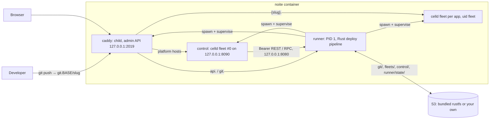

# Noite: tiny self-hostable celld PaaS

Status (2026-10-06): the alpha ships releases — `0.1.0-alpha.1` and `0.1.0-alpha.2` are published as pre-releases, and `0.1.0-alpha.3` is in `CHANGELOG.md` under `Unreleased`, about to be tagged. One image, tenant isolation, bucket-held runner state, graceful shutdown, readiness and in-place schema upgrades are implemented and verified (`cargo build --release`, `cargo test`, `clippy -D warnings`, `bun run check`, `make e2e`, `make e2e-isolation`, the dev overlay). Scoped per-app credentials are scaffolded; no provider mints them yet. There is no v1 compatibility: installs from before the 2026-09-27 one-image change are wiped and reinstalled, while alpha installs upgrade in place ([Runner schema evolution](#runner-schema-evolution)).

Noite's promise is "your own tiny Cloudflare Workers": a person runs one install, and other people push code to it. That makes tenant code **untrusted**, and it makes the install something people deploy on Compose, Railway, Coolify or a VM with minimal effort. This file is the design record: the locked decisions first, then how each part works and the contracts it depends on. Roadmap, open questions and design history live in [ROADMAP.md](ROADMAP.md); release notes in [CHANGELOG.md](CHANGELOG.md).

## Decisions (locked)

- **Product:** full tiny PaaS — user accounts, apps, subdomains, thin deploy/build logs + status.
- **Tenancy:** one operator per install; no orgs; users own apps; per-app collaborators (`view` / `push` / `admin`). `NOITE_TENANCY=multi` (the default off `localhost`) treats pushed code as untrusted and sandboxes it; `single` means only the operator pushes code.
- **One image:** `ghcr.io/<owner>/noite`. `tini` → the Rust runner as PID 1, which supervises Caddy, the control UI and every tenant fleet. Every platform deploys the same image.
- **Control plane:** **Oxide Worker UI** (`apps/noite`, `preset: worker` — workflows/queues/cron, D1 auth DB) served as celld fleet #0, plus the **Rust runner** (`apps/runner`; a Rust binary can't be a worker), which owns deploys, fleets, routing and the edge config.
- **Tenant runtime:** each app is its own celld fleet (its own bucket prefix and process).
- **Source:** stock Git smart-HTTP at `http://git.$BASE_DOMAIN/{slug}` (Basic `git` / profile API key; collaborator `view`/`push`) → runner writes tip `s3://noite/git/{slug}/refs/heads/main/{sha}.bundle` + a `MANIFEST.json` linearization point.
- **Deploy:** push to `main` (and/or tip poll / webhook) → bare mirror + checkout → build → `celld deploy` → reload.
- **Isolation:** one app = one fleet; never share `deploy/current.json`.
- **Edge:** Caddy inside the image — per-host on-demand TLS (ask-gated at `/v1/edge/tls-ask`), Host routing to the control UI (`CONTROL_SUBDOMAIN=app` in prod, bare domain in dev), `api.`/`git.` → runner, `{app}.$BASE_DOMAIN` → the app's fleet (`app`/`api`/`git` slugs reserved). Behind a terminating proxy (Coolify/Traefik TCP-forwarding SNI, Railway) our Caddy still issues per-host certs on demand where the proxy passes TLS through, and serves plaintext `:80` where it does not.
- **State:** one S3 bucket holds everything durable; the `/data` volume is a cache the runner can rebuild from it.
- **Effect:** prefer `Effect` / `Config` / `Schedule` / `Schema` / `HttpClient` / `Layer` over ad-hoc async.

## Architecture


```mermaid
flowchart LR
  dev[Developer] -->|git push → git.BASE/slug| edge
  user[Browser] --> edge
  subgraph noite[noite container]
    runner[runner: PID 1, Rust deploy pipeline]
    edge[caddy: child, admin API 127.0.0.1:2019]
    control[control: celld fleet #0 on 127.0.0.1:8090]
    fleet[celld fleet per app, uid fleet]
    runner -->|spawn + supervise| edge
    runner -->|spawn + supervise| control
    runner -->|spawn + supervise| fleet
    edge -->|platform hosts| control
    edge -->|api. / git.| runner
    edge -->|"{slug}."| fleet
    control -->|Bearer REST / RPC, 127.0.0.1:8080| runner
  end
  runner <-->|git/, fleets/, control/, runner/state/| s3[(S3: bundled rustfs or your own)]
```

### Process tree

```
tini (PID 1: reaps zombies, forwards signals)
└── noite-runner                      root; API on :8080
    ├── caddy run --watch             :80/:443, admin 127.0.0.1:2019
    ├── celld  control fleet #0       public 127.0.0.1:8090, internal 0.0.0.0:8091
    ├── celld  tenant fleet × N       uid fleet (10020); public 0.0.0.0:{p}, internal 127.0.0.1:{p+1}
    └── bun / sh                      builds and release, one uid per app (10030+), transient
```

- The runner owns every child's lifecycle (`host/children.rs`: restart with 1–30 s backoff; SIGTERM, then SIGKILL past the budget). There is no second supervisor and no shell entrypoint.
- The runner stays root: it needs `setuid`, `chown` and `nft`. Its children are the privilege boundary.

### Code layout

The runner layers strictly: `service/*` holds one implementation per operation; the REST handlers (`api/*`, route table `api/router.rs`) and the JSON-RPC dispatcher (`api/rpc.rs`) are peers over it, each decoding its own transport and encoding the same result — `api_error.rs` carries the shared error type and maps it onto an HTTP status or a JSON-RPC error, and no REST module imports the RPC module. `db/` is the SQLite layer in cohesive submodules (`apps`, `deploys`, `metrics`, `errors`, `events`, `env`, `credentials`, `compaction`, `alloc`) re-exported through `db/mod.rs`; `host/` is the OS/process work — `host/exec.rs` runs sandboxed children (builds, releases, runner-owned tools) while `host/s3.rs` owns the object store — and `host/metrics/` is the telemetry substrate.

The control UI mirrors that split: `src/http/` is the plain-HTTP layer (`router.ts` + `routes/*`, over `body.ts`/`config.ts`/`sse.ts`/`session.ts`); `src/lib/server/*.server.ts(x)` holds every server-only module (the `.server.` suffix marks an oxidejs action module); `src/lib/ui/` the shared primitives; the feature folders `src/lib/{admin,account,auth,apps,source,app-detail,storage}/`; and `src/lib/` at the root is the shared data/pure layer (`resources.ts`, `feeds.ts`, `swr-store.ts`, `runner.ts`, `db.ts`).

Repo tooling: `docker/lib.sh` is sourced by the standalone repo scripts (`doctor`, `backup`, `restore`, `usage`, `e2e-local`), while `install.sh`/`uninstall.sh` stay self-contained because `run.sh` curls each from a raw URL. `.github/workflows/check.yml` is the reusable gate (`workflow_call`) shared by `ci.yml` and `images.yml`.

The types the two halves share are generated: every REST-boundary struct/enum derives `#[ts(export)]` and `apps/runner/.cargo/config.toml` exports them (`TS_RS_EXPORT_DIR` → `apps/noite/src/lib/runner-types`, `TS_RS_LARGE_INT = "number"` so i64/u64 stay TypeScript numbers) on `cargo test --locked export_bindings`. `lib/runner.ts` imports and re-exports the files under the UI's `Runner*` aliases (UI-only derived shapes and the D1 caps extensions stay hand-written there); the generated directory is ignored by lint/format, never hand-edited, and CI's `types` job fails on a diff.

### Ports and bucket

The operator-facing description of the published/fleet ports, the edge's Host routing and the bucket layout lives in the website docs ([How it works](apps/website/docs/02-how-it-works.mdx): Ports, Bucket layout). The contracts this design depends on:

- Fleet ports are two per app from `NOITE_FLEET_PORTS` (default `20000-29999`), allocated by `db/alloc.rs::next_ports_in`; exhaustion errors instead of wandering into ephemeral ports.
- `git/{slug}/` holds tip bundles from Git HTTP plus `MANIFEST.json` (`{seq, refs}`; readers resolve refs from the manifest so half-written pushes stay invisible); `fleets/{slug}/` is tenant celld (deploys, storage, telemetry); `control/` is the UI worker bundle + its D1 (accounts, invites); `runner/state/` is the runner SQLite snapshots + the `owner.json` fence.
- The runner ensures bucket `NOITE_S3_BUCKET` (default `noite`) on boot, enables versioning best-effort, and uses root keys for deploy/reconcile (see [Scoped credentials](#scoped-credentials)).
- `/data` (volume `noite-data`): the live runner SQLite, git mirrors, builds, fleet working dirs, the control node's working dir, Caddy config and certificates. Everything in it is rebuildable from the bucket (certificates are re-issued).

### Image

`docker/Dockerfile` is the only Dockerfile. Stages: `celld` (pinned `CELLD_VERSION`), `runner-build`, `ui-build`, `base` (bun on Debian + the `node` binary `NODE_VERSION` + jup `JUP_VERSION` from its npm tarball, checked against `JUP_SHA512`, with `npm`/`pnpm`/`yarn` shims in `/usr/local/bin` + `tini`, `ca-certificates`, `curl`, `git`, `awscli`, `nftables`, sidecars from `docker/install-sidecars.sh`, Caddy `CADDY_VERSION`, the `fleet` user and the reserved per-app build uid range (`BUILD_UID_BASE`/`BUILD_UID_RANGE`, pre-created in `/etc/passwd` so Node tools resolve it)), `dev`, and `noite` (the default last stage: runner binary + `/opt/noite/control/dist`). `docker/check-versions.ts` asserts each pin appears exactly once, that the access-log path matches the runner's default, and that the image's passwd uid range matches `config.rs`. `awscli` stays for release commands and debugging. CI builds `noite` for amd64 and arm64 on native runners and merges the digests (`.github/workflows/images.yml`).

## Tenant isolation

celld's internal listener carries peer traffic and an **unauthenticated operator API** (`POST /shutdown`, `POST /reload`, `POST /rebalance/pause`, `GET /state`); celld's security model assumes a trusted private network protects it. Noite runs untrusted Worker code in the same container, so the platform closes that network to tenant code itself.

### Tenancy mode

`NOITE_TENANCY=single|multi` (default `multi` when `BASE_DOMAIN` is not `localhost`, else `single`). `host/isolation.rs::self_check` runs at boot: build uid drop, fleet uid drop, nft table installed.

- `multi`: any failed check keeps `/ready` at 503 with the reason and refuses builds.
- `single`: checks run and warn, nothing is refused; fleets and release commands use the root bucket keys, and no egress policy is installed.

This is the honest contract for platforms that cannot provide isolation: they run Noite for one person.

### Build and release sandbox

- `exec::run_sandboxed` starts from `env_clear()`, adds `base_env` (`PATH`, `TMPDIR`, `LANG=C.UTF-8`, `CI=1`, `NODE_ENV=production`, `NO_COLOR=1`, and the per-app cache root `/data/runner/cache/<slug>`: `BUN_INSTALL_CACHE_DIR=bun/`, `JUP_HOME=jup/`, `HOME=home/`, so npm, pnpm and Yarn cache per app too — a shared `HOME` was one cache for every tenant; `JUP_ENABLE_AUTO_PIN=0`, `JUP_QUIET_ADVISORIES=1`) and the tenant's vars, drops to the app's own uid in `multi` (one per app, from the reserved range), runs in its own process group, and `killpg`s the group after every step. `run_cmd` (runner-owned tools: `git`, `celld deploy`, `aws`, `duckdb`) clears the environment too.
- Tenant vars never carry platform names: the reserved-name filter in `db/env.rs` drops `PORT`, `HOST`, `AWS_*`, `S3_*`, `CELLD_*`, `RUNNER_*`, `NOITE_*`, `BETTER_AUTH_*`, `CADDY_*`, `LD_*`, `NODE_OPTIONS` and `BUN_*` (except the cache var).
- Bounds: `bun install` and the build `RUNNER_BUILD_TIMEOUT_S` (300) each, the `cloudflare.config.ts` conversion 60 s, release 600 s; `RLIMIT_NPROC` (only when dropping uid) and `RLIMIT_FSIZE`; a worktree above `RUNNER_BUILD_MAX_MB` (2048) fails the deploy.
- Worktrees are `lchown`ed to the build uid (never following symlinks) and taken back after the build. `builds/<slug>` is 0755 so bun can resolve its cwd.
- Once the tree is taken back, the deploy root must resolve inside it and its Wrangler config may not be a symlink (`deploy.rs::contained_deploy_root`): `celld deploy` runs as the runner, so a `dist` symlink into `/data` would ship platform files into the tenant's bucket. The check runs after the last tenant step (release), not when the root is picked. Symlinks further down (`main`'s imports, files in the assets directory) are not checked yet.
- **Release** (`release` in the tenant's `wrangler.jsonc`, meant for migrations) runs in `multi` only with scoped bucket keys, so it is **skipped** there until a credential provider lands, with a deploy-log line saying so. In `single` it runs with the root keys. Noite's `release` key is stripped from `wrangler.json` before `celld deploy` (celld rejects unknown keys).
- Build network stays open (package registries); the egress policy below applies to the build uid as well.

### Egress policy

`host/netisolation.rs` installs one nft table in `multi` (it needs `CAP_NET_ADMIN`). For the build and fleet uids, in order:

1. accept `ct state established,related` (without it, replies on connections the runner itself opened were rejected);
2. accept DNS (udp/tcp 53);
3. accept the storage endpoint, for the fleet uid only: the addresses `S3_ENDPOINT` resolves to, on its port, refreshed every 30 s (a fleet's celld needs its bucket, and bundled RustFS sits on a private address);
4. reject loopback (`127.0.0.0/8`, `::1`), RFC 1918, link-local and metadata (`169.254.0.0/16`), CGNAT (`100.64.0.0/10`), and ULA/link-local IPv6 (`fc00::/7`, `fe80::/10`).

Since all fleets share one uid, "the fleet uid may not dial loopback" blocks fleet → fleet, fleet → operator API, fleet → runner and fleet → Caddy admin. A single-node fleet never needs to dial loopback: Caddy dials the fleet, not the reverse. The same rules, loopback included, apply to builds. Tenant fleets additionally bind their internal listener to loopback. The control node's internal listener binds `0.0.0.0:8091` so a replacement node can reach it during an overlapping redeploy; the policy, not the bind, keeps tenants off it.

Fallback where a platform grants no `NET_ADMIN` (not built): run each fleet under `bwrap --unshare-net` with `pasta`/`slirp4netns` for internet-only egress. Upstream requests worth filing with celld: an auth token for the operator API, and an outbound policy for the main Worker.

### Data directory

`isolation::harden_data_dir` runs first at boot: the runner sets umask 077, `/data`, the work dir, `builds` and `fleets` are 0755 for traversal, every other entry is 0700/0600, and the SQLite files (`-wal`, `-shm` included) are 0600. The hostile suite found the gap that motivated it: the build uid could read `noite.sqlite`.

### Hostile-tenant suite

`apps/noite/test/hostile/` is a sample app whose Worker, build script and release script attempt each attack and report JSON; `apps/noite/e2e/hostile.spec.ts` asserts every attempt failed. It runs in `make e2e-isolation` (`NOITE_TENANCY=multi`, `E2E_HOSTILE=1`) and is skipped otherwise.

| Probe | Where | Must |
| --- | --- | --- |
| `process.env` / `/proc/self/environ` for `RUNNER_TOKEN`, `AWS_SECRET_ACCESS_KEY`, `BETTER_AUTH_SECRET` | build, release | none present |
| read `/data/noite.sqlite`, git mirrors | build | EACCES |
| a neighbour's internal `/state`, `POST /shutdown` | Worker | refused |
| the runner on `127.0.0.1:8080`, the control node on `:8091` | Worker, build | refused |
| the object store root | Worker | refused or 401/403 (reachable by design, holds no keys) |
| `169.254.169.254` | Worker, build | refused |
| `https://example.com/` | Worker | succeeds |
| the neighbour app still serves afterwards | lane | 200 |

### Known limits

- The build uid is **shared**, so two concurrent builds can read each other's worktrees. Acceptable while tenants are untrusted rather than adversarial; per-build uids are the fix.
- Fleets hold the **root** bucket keys until [Scoped credentials](#scoped-credentials) land, so a compromised fleet process can reach every prefix.
- Worker code can reach the object store's unauthenticated surface (it answers 401/403).
- Sandbox depth is uid + env + rlimits + egress rules. A container per build (rootless Podman in the image, gVisor) is out of scope unless tenants are expected to be adversarial.
- No per-tenant memory containment: fleets share the container cgroup, so one fleet's growth pushes every fleet toward the shared shed threshold. Per-fleet cgroups (memory.max per fleet, which also gives celld a per-fleet working set) are the fix where cgroupfs is writable.
- Railway does not grant `NET_ADMIN` (verified 2026-09-27: `nft` fails with `Operation not permitted`), so Railway installs run `NOITE_TENANCY=single`. Railway also wraps the entrypoint, so tini is not PID 1 there; set `TINI_SUBREAPER=1`.

## Control UI (fleet #0)

`host/control.rs` deploys and `host/control.rs::supervise` runs the control worker as a reserved fleet:

1. Wait for the bucket (`ensure_buckets`, with RustFS status diagnostics).
2. Build the worker's vars from the runner's config (`CONTROL_PASSTHROUGH`: `BETTER_AUTH_SECRET`, `NOITE_ADMIN_EMAIL`, `NOITE_AUTH_RATE_LIMIT`, `NOITE_EMAIL_WEBHOOK_URL`, `NOITE_RATE_LIMIT_RPM`, `NOITE_SMTP_FROM`, plus the URLs), dropping empty values.
3. Revision = hash of the bundle's `REVISION` and the vars; if it differs from the marker in the bucket, write `wrangler.json` into a temp copy of `/opt/noite/control/dist`, `celld deploy` it to `s3://{bucket}/control`, then store the marker. A restart with the same bundle and vars deploys nothing.
4. Spawn celld with `--listen 127.0.0.1:8090 --internal-listen 0.0.0.0:8091 --advertise <CELLD_ADVERTISE | RAILWAY_PRIVATE_DOMAIN | /etc/hostname>:8091`, `CELLD_TRUST_FORWARDED_HEADERS=1`, `CELLD_WATCH=/data/control`, `CELLD_READY_FLEET_GATE_MS=15000`, `CELLD_DURABILITY=bucket` and `CELLD_SHUTDOWN_TOTAL_MS` inside the stop budget. The advertise has to be an address a _peer_ can dial: during an overlapping redeploy the new node takes cells over from the old one through it, and a loopback advertise makes it dial itself. An explicit `--advertise` requires an explicit `--internal-listen` — the docs mandate the pair. The operator API on `:8091` is closed to tenant code by the `multi` egress policy, not by the bind.

The worker reaches the runner at `http://127.0.0.1:8080`. When the image has no bundle (the `dev` target), the runner skips the control child and `vite dev` serves the UI on the same address.

## Edge

- Caddy is a runner child (`--watch` on `/data/caddy/Caddyfile`, admin on `127.0.0.1:2019`). `host/caddy.rs` generates Caddyfile text (the generator and its tests are unchanged), writes it only when it changed, and `POST`s it to the admin `/load`; a rejected config is logged with Caddy's error and surfaced in `/ready`, and the previous config keeps serving. Admin connection errors during Caddy's own startup are debug-level.
- Upstreams are loopback: control `127.0.0.1:8090`, `api.`/`git.` `127.0.0.1:8080`, tenants `127.0.0.1:{port}`.
- Every site carries `encode zstd gzip` (celld does not compress; `text/event-stream` stays uncompressed and unbuffered) and a 30 s `response_header_timeout`.
- Tenant and custom-domain sites are **gated on fleet readiness** (`caddy.rs::TENANT_PROXY`): Caddy health-checks `/.well-known/celld/health` (503 until celld's ready gate opens) on load and every second, holds a request up to 20 s (`lb_try_duration`) while the fleet is not ready, and otherwise serves a self-refreshing "starting" page with 503 + `Retry-After: 5` (`TENANT_STARTING`, `handle_errors 502 503`). A ready fleet is proxied with no added wait; a held request is never sent, so POSTs are safe. celld's own 503s (load shedding) pass through.
- Access log at `/data/caddy/access.log` (one constant, `CADDY_ACCESS_LOG`); Caddy does not roll it, the tailer (`host/accesslog.rs`) truncates after reading. Metrics do **not** come from it.
- On-demand TLS is ask-gated at `/v1/edge/tls-ask`: a certificate is minted only for a platform host or a live tenant/custom host. `CADDY_AUTO_HTTPS=off` behind a terminating proxy serves plaintext `:80`.
- **Edge limits** (`caddy.rs::guard_lines`, built from `Config::edge`). Every public site gets a `rate_limit` block from github.com/mholt/caddy-ratelimit, which the image compiles into Caddy (`caddy-build` stage, commit-pinned by `CADDY_RATELIMIT_VERSION`):
  - per client IP (`{client_ip}`, IPv6 grouped by `/64`): `NOITE_EDGE_RPM` (1800/min) on control, `api.`, the fallback page and each app; `NOITE_EDGE_GIT_RPM` (120/min) on `git.`;
  - per app across every client: `NOITE_EDGE_APP_RPM` (0 = none). An app overrides both in `app_limit` (NULL = default, 0 = off; RPC `limits.get|set`, admin-gated in the UI). Zones are named `client_<slug>`/`app_<slug>`/`client_control`…, and the module shares a zone's state by name across site blocks, so an app's subdomain, custom domains and plaintext twins draw from one budget. Limits are per minute, enforced as a sixth per 10 s window: the module keeps a ring buffer per key sized by the event count, so a one-minute window would cost six times the memory per address in a wide flood. Over a limit: 429 + `Retry-After`; the default logger excludes `http.handlers.rate_limit` so a flood does not flood `docker logs` (the access log still records each 429).
  - `servers { timeouts { read_header 10s; idle 2m } }` drops slowloris clients. No read/write timeout (event streams, uploads) and no `request_body` cap: measured behind `reverse_proxy`, an oversized body reached the upstream or failed as a 502, which on a tenant site renders the "starting" page.
  - `NOITE_TRUSTED_PROXIES` (`cloudflare` = the published ranges plus `client_ip_headers CF-Connecting-IP X-Forwarded-For`, `private_ranges`, CIDRs) → `trusted_proxies static … ` + `trusted_proxies_strict`; the control site then sends `header_up X-Forwarded-For {client_ip}`, because the worker keys its own limits on the right-most entry, which would otherwise be the proxy. With `CADDY_AUTO_HTTPS=off` on a real domain and no trusted proxies, every request comes from the proxy, so per-client zones are left out (`Config::edge_sees_clients`) and the runner warns at boot; per-app ceilings still apply.
  - The runner runs `caddy list-modules` at boot (`caddy.rs::detect_modules`) and writes no `rate_limit` when the module is missing: a stock Caddy would reject the whole file and keep serving the bootstrap config.
- Scheme is pinned per host on plaintext twins (`caddy.rs::plaintext_hosts`): Caddy applies an address line's scheme to the first address only, so `http://app.x, extra.x` once bound the extra host on `:443` and made the whole config unadaptable (`ambiguous site definition`). Regression tests: `plaintext_twin_pins_the_scheme_per_host`, `behind_proxy_extra_control_host_keeps_a_valid_twin`.

## Runner state

`host/state.rs` makes the volume a cache:

- **Write path:** a task polls `PRAGMA data_version` every 2 s; after a change it waits for 10 s of quiet and at most one upload a minute, then `VACUUM INTO` a temp file and uploads `runner/state/noite.sqlite`. Also on graceful shutdown and on `POST /v1/admin/snapshot`. The loss window on an ungraceful crash is therefore about 70 s of API mutations. Everything else is reconstructible: git mirrors from tip bundles (`host/rehydrate.rs`), fleets from the bucket, telemetry from Parquet.
- **Single writer:** `claim()` writes `runner/state/owner.json` at boot and every upload re-checks it first (`still_owner`), so a replaced runner stops uploading instead of overwriting its successor. This is a fence rather than an `If-Match` conditional write because not every S3 store supports those.
- **Boot path:** if the local database is missing, download the snapshot into `.restoring` and rename it into place before `db::connect`. Not-found starts fresh; any other error is retried and then **fails the boot**, because an empty database would overwrite the good snapshot. A local file always wins over the bucket (only local state is ever uploaded).
- Litestream was considered: a smaller loss window for a sidecar and a second config surface. Revisit if operators report lost mutations.

## Shutdown

On SIGTERM/SIGINT the API stops accepting, the reconcile loop stops spawning, and `supervisor::stop_all` signals every tenant fleet and the control node at once (`libc::kill`), waiting under one budget `NOITE_STOP_BUDGET_MS` (25000; each celld gets a `CELLD_SHUTDOWN_TOTAL_MS` below it so it seals its node log inside ours). Survivors get SIGKILL. Then Caddy stops (5 s), last, so in-flight requests drain through it, and then the final state snapshot is written. Compose sets `stop_grace_period: 35s`; Railway needs `RAILWAY_DEPLOYMENT_DRAINING_SECONDS=35`. The docs require the orchestrator's stop grace to exceed the node's shutdown bound. A single fleet stop (`stop_fleet`) sends SIGTERM (`libc::kill`; the documented signal, which lets celld cancel in-flight work, prove durability, release its leases and seal its node log) and waits 15 s before the SIGKILL fallback. SIGTERM/SIGINT handling is installed before anything is spawned or uploaded (the first thing boot does), so a signal that lands at any point in the boot still runs the whole contract — fleets, control, Caddy, final snapshot — instead of the default hard exit.

## Boot order (the upgrade window)

Boot is ordered by what tenants need, and that ordering is the tenant-facing downtime of every upgrade:

1. Signal handling first, before any child exists (see [Shutdown](#shutdown)).
2. Caddy, on the Caddyfile the volume already has, so routes are live or answering the "starting" page.
3. The reconcile loop's first tick spawns every tenant fleet (all of them within ~50 ms of the container starting).
4. The REST listener binds.
5. Only then does the runner deploy the control UI (`control::ensure_deployed` uploads on any release whose UI bundle or vars changed: measured 0.66 s against a local store, more against a remote one) and start the control fleet.

Measured on a 32-core host with 15 apps: first fleet healthy 2.1 s after the container started, all of them 5.1 s. Never put the control deploy, `rehydrate_all`, or any other non-serving work in front of the fleet spawn.

## Readiness

`GET /ready` answers 200 only when all hold, else 503 with `{"ok":false,"failing":[…]}`: first reconcile done (`reconcile`); the bucket answers (`bucket: …`, cached briefly); `multi` isolation checks passed (`isolation: …`); the control fleet is healthy when the image has a bundle (`control: …`); Caddy accepted the last config (`caddy: …`). It is the container healthcheck and what `make doctor` prints. One check fits Compose, Railway, Coolify and Fly.

## Scoped credentials

Goal: a compromise of one fleet reaches one app.

Built (`host/credentials.rs`, table `app_credential`): rows are AES-256-GCM with a random nonce and the app id as associated data, under a key derived from `RUNNER_TOKEN` with HKDF, so the snapshot in the bucket is not a key dump and a row cannot be replayed onto another app. Lookups: `scoped_credentials` (the decrypted row or nothing), `tenant_process_credentials` (scoped, else root in `single` only; used by release), `fleet_credentials` (scoped, else root). `mint` refuses to store root keys. No provider mints keys yet, so fleets run with root keys.

To build: a `CredentialProvider` (`app_credentials(slug)`, `revoke(slug)`), keys minted at app create, rotated on rename, revoked on delete (`host/purge.rs`), used by fleet spawn, release and the D1 table editor.

| Store | Mechanism | Status |
| --- | --- | --- |
| RustFS | IAM user + policy on `arn:aws:s3:::{bucket}/fleets/{slug}/*` via its admin API | verify support at the pinned version |
| MinIO | same, admin API user + policy | supported |
| AWS S3 | IAM user or STS `AssumeRole` with a prefix-scoped session policy | supported |
| Cloudflare R2 | tokens scope to buckets: bucket-per-app (`noite-{slug}`) via the Cloudflare API | optional provider; changes the bucket layout on R2 |
| Tigris | per-bucket keys; bucket-per-app like R2 | verify |
| none of these | root keys | `single` only |

celld's storage contract (conditional writes, read-after-write, ranged reads) must hold under the scoped keys; celld's startup check fails loudly when a policy blocks a required call. Order: MinIO/S3 first, RustFS after verification, R2 last. Done when fleet keys fail `ListObjectsV2` outside `fleets/{slug}/`, release migrations work with them, and purge revokes them.

## Configuration

`config.rs` is the single source of truth: one struct, defaults in one place, and no aliases (every variable has exactly one name). `Config::validate` fails the boot with a list of problems: the dev `RUNNER_TOKEN`, dev `BETTER_AUTH_SECRET` (`dev-` prefix) or the compose-default S3 keys on a non-`localhost` `BASE_DOMAIN`; a `BETTER_AUTH_URL` host the edge does not serve as a control host; a bad `NOITE_FLEET_PORTS` range; a malformed (`RUNNER_TELEMETRY_RETENTION_DAYS` must be an integer) or `< 1` `RUNNER_TELEMETRY_RETENTION_DAYS`; a stop budget under 5 s; on Railway, a draining window shorter than the stop budget. The worker refuses default secrets off-localhost on its own too (`auth.ts::defaultSecretRefusal`). `.env.example` documents every variable and `docker/compose.yaml` gives each a default.

## Operator recovery

`docker compose exec noite noite-runner recover [--email]` (`apps/runner/src/recover.rs`) asks the control worker's `POST /internal/recovery` (runner-token gated, rate limited) for a one-time emailOTP sign-in code. The OTP sender must keep receiving `NOITE_EMAIL_WEBHOOK_URL`/`BASE_DOMAIN`/`NOITE_SMTP_FROM` (`authEnv` in `auth.ts`): leaving them out once sent every code to the console.

## Install targets

Operator guide: `apps/website/docs/self-hosting/platforms.mdx`.

- **Compose:** `docker/compose.yaml` is the whole install: one `noite` service (image `${NOITE_IMAGE:-ghcr.io/ryuzcorp/noite:alpha}`, `cap_add: NET_ADMIN, SETUID, SETGID, CHOWN`, volume `noite-data:/data`, healthcheck `/ready`, stop grace 35 s) and `rustfs` (1.0.0, API on loopback). `noite` depends on `rustfs` with `required: false`, so BYO S3 is `--scale rustfs=0` plus `S3_ENDPOINT` and keys. Every variable is defaulted, so the file boots as-is from a store or panel. Overlays: `compose.build.yaml` (build from the tree: `make up`), `compose.dev.yaml` (the `dev` target with sources bind-mounted: `make dev`), `compose.e2e.yaml` (the test lane).
- **Coolify:** the same file; the Traefik TCP router for `*.<domain>` SNI passthrough is a label on `noite`, and domains go on the `noite` service (`SERVICE_URL_NOITE_80`).
- **Railway:** one service from the image, one volume at `/data`, R2/Tigris or a `rustfs` service. Domain target port 80, `CADDY_AUTO_HTTPS=off` (Railway terminates TLS; one `*.<domain>` custom domain covers every host), `RAILWAY_DEPLOYMENT_DRAINING_SECONDS=35`, and `PORT=8080` + path `/ready` + `RAILWAY_HEALTHCHECK_TIMEOUT_SEC=600` for a healthcheck (Railway probes `PORT`; the runner never reads it).
- **Dev:** `docker/dev.sh` runs the runner under cargo-watch and `vite dev` on `127.0.0.1:8090`. `celld dev` cannot serve the UI (raw esbuild cannot resolve Oxide's `virtual:oxide/worker`), the one deliberate divergence from celld's documented dev flow.
- **E2E:** `make e2e` builds the image (or `TAG=<sha>` pulls it), boots it as project `noite-e2e` with its own bucket and ports (UI :8090 through Caddy, API :8080, tenants 20000+, rustfs :19000), resets containers and volumes by label and name (podman-compose's `down -v` aborts on the first missing container), runs doctor and Playwright. `make e2e-isolation` = the same in `multi` plus the hostile suite. `E2E_KEEP=1` leaves the stack up.
- **Backup:** `make backup` snapshots the runner, stops the stack, tars `noite-data` and `rustfs-data` with a `MANIFEST`, starts again. `make restore FROM=…` is destructive. With your own bucket, use provider versioning.
- **Updates** restart the runner and every fleet with it (cold boots). Installs follow a release channel (`alpha`, the default; `stable` for final releases only; a version tag pins). `main` publishes `edge` and a short SHA, which are not install targets. A `v*` tag publishes the version image only after the e2e lanes and the CHANGELOG check pass (`images.yml`, `e2e.yml`, `docker/check-changelog.ts`), plus a GitHub pre-release; `run.sh | bash -s install --pre` installs it pinned. Marking it as a full release runs `promote.yml`, which points `alpha` (and `stable` for a final version) at that same manifest; only the latest release promotes, and `workflow_dispatch` re-points the channel by hand (rollback). Batch upgrades, and set `NOITE_IMAGE` to a version or short-SHA tag to hold back or roll back (a release that changed a schema refuses a downgrade).

## Deploy pipeline and Git

- Trigger: push fast-path (spawn after receive-pack), reconcile poll of `MANIFEST.json` + the main tip bundle, and a bearer-gated `/webhook` nudge. RustFS notifications stay off (they cannot carry a bearer).
- Pipeline: tip `.bundle` → bare mirror `repos/{slug}.git` + worktree → sandboxed `bun install` when there is a `package.json` → build: Wrangler's `build.command` (in `build.cwd`) if set, else `bun run build` when `scripts.build` exists → `cloudflare.config.ts` conversion when the tree has no Wrangler config → deploy root → optional release → strip runner keys (`release`, `build`) → `celld deploy` → spawn or `POST /reload` on the fleet's internal listener. A failed release keeps the old deployment serving. Deploy logs keep a 64 KB tail.
- **Build output** (`host/build_output.rs`). When a build ran, what it produced outranks the source config: `dist/wrangler.json` first (Oxide on Vite or Rsbuild), then Wrangler's deploy redirect `.wrangler/deploy/config.json` (`@cloudflare/vite-plugin`). celld 0.6 refuses the plugin's `dist/<worker>/wrangler.json` as is (about 30 Wrangler-only keys, `assets.directory: "../client"`, `.assetsignore`), so the runner writes `wrangler.json` at the nearest directory holding the Worker and its assets (normally `dist/`): the keys celld accepts (the oxidejs `CELLD_WRANGLER_KEYS` list; `no_bundle` dropped so celld bundles the chunks), `main`/`assets.directory` relative to it, a D1 `migrations_dir` outside it dropped, and the plain names in `.assetsignore` deleted (a glob fails the deploy). The redirect target, `main` and the assets must resolve (symlinks too) inside the worktree; `auxiliaryWorkers` fail the deploy, and so does output sharing a directory with the source config. Without a build, or with neither file, the source config deploys as before, so a committed `dist/` never outranks it and CLI-pushed trees are unaffected.
- **Generated config** (`host/generated_config.rs`). When neither the build output, the root, nor a subdirectory (`node_modules` skipped; it once recursed into it) has a Wrangler config, the runner writes `wrangler.json` at the root instead of failing with "no wrangler.json": a **static site** from the first of `dist/`, `build/`, `out/` holding an `index.html` (assets only; `not_found_handling` `404-page` when there is a `404.html`, else `single-page-application`), or a **Worker** from `package.json` `main` when that file exists (`nodejs_compat`, plus the static output as assets with an `ASSETS` binding). The plan is made before the release step, so a tree with nothing deployable fails early; the file is written after the worktree is chowned back, with every path re-resolved inside the project. Refused with a message: a `main` that looks like a Node server (`.listen(`/`createServer(` and no `fetch`), and a `main` inside the public output. Measured on celld 0.6: an asset-only project serves client routes with the SPA fallback; `node:http.createServer` and `IncomingMessage` throw "not implemented in celld", so Express does not run even through srvx's `toFetchHandler` bridge. Running real Node processes (srvx as the launcher) is a separate, undecided runtime.
- **Package managers** (`host/package_manager.rs`). Install and build use the project's manager: a `packageManager` / `devEngines.packageManager` pin with a version → `jup install` / `jup run build` (that exact release, bun included); else the lockfile → bun for `bun.lock(b)` (the image's bun), otherwise jup with a spec file the runner writes beside the tree (`JUP_SPEC_FILE=<work>/package-manager.json`, `devEngines.packageManager`): pnpm at the major its `lockfileVersion` needs (jup's table), Yarn `^1` for a `# yarn lockfile v1` file else latest, npm latest; no lockfile → bun. jup does not infer a manager from lockfiles (unpinned, `jup install` refuses, and `yarn` alone is Yarn 4, which rejects a v1 lockfile), hence the spec. The same env reaches release, and the image's shims make `npm`/`pnpm`/`yarn` inside scripts follow the spec. jup downloads each release into the app's cache and verifies it against the registry signature; the build never edits `package.json`. The build cache is pruned by whole caches, largest first (a store with files missing breaks the next build; a missing one only costs a download). jup is experimental (0.x); its version is pinned with the tarball digest.
- **Deploy steps.** One deploy row per run: each step logs `▸ step: detail` (`fetch`, `install`, `build`, `convert`, `generate`, `release`, `deploy`, `start`) and its output tail (4 KB, ANSI stripped, `NO_COLOR=1` in the sandbox). A failure appends `ERROR: <step> failed` and the error tail (24 KB) to the same row, and `app.last_error` becomes `<step> failed: <first error line>`. Before this, the failure landed on a second row and the first stayed `building` until the stuck sweep.
- **`cf` CLI config.** An app may declare its Worker in `cloudflare.config.ts` (the `cf` CLI's config) instead of `wrangler.json(c)`. When neither the root nor `dist/` has a Wrangler config after the build, the runner runs `host/cf-config.mjs` with `node` in the build sandbox: `@cloudflare/config` (from the app's own `cf` dependency) loads the config and converts it with `convertToWranglerConfig`, and the script writes `wrangler.json`. Node, not Bun: the loader needs Node's module hooks and refuses Bun. celld 0.6 rejects the new `exports` key, so created Durable Objects become one `v1` migration (`new_sqlite_classes` / `new_classes`); deleted, renamed and transferred classes and other export kinds fail the deploy. `secrets` is dropped (app env vars fill that role), a D1 binding without an id uses its name, and a DO binding to the app's own class loses `script_name`. The `cf` config has no D1 migrations directory and no `release`.
- The config `celld deploy` uploaded is stored as JSON in `app.deployed_config`; the storage views read it first and fall back to the Wrangler file in the pushed source.
- Rollback: `POST /v1/apps/{id}/rollback {sha}` redeploys a past successful sha (bundles are immutable per sha); the UI offers it on success rows.
- Tenant env: `app_env` + `/v1/apps/{id}/env` (admin-gated writes), injected into build, release and fleet env minus the reserved names; Values are write-only in the UI: `env.list` is redacted by the control worker (only `FLAG_*` rows holding `1`/`0` carry a value, for the toggles), and the `.dev.vars` download in settings is admin-only.
- Git hardening: `MANIFEST.json` linearization per slug, receive-pack head parsing, per-role push policy (`push` = create + fast-forward only, `admin` = anything), per-slug push mutex, manifest re-apply on reads (`git_policy.rs`, `git_manifest.rs`). Git keys must sit under `git/`, and a manifest read error other than not-found is an error, not an empty repo.
- Auth: profile API keys (Better Auth); the runner verifies via the UI's `/internal/git-auth` and the collaborator role (`view` fetch, `push` receive).
- CLI (`packages/cli`, `@noitenow/cli`, publishable): `noite deploy` pushes a CI-built dist + `wrangler.jsonc` as a synthetic fast-forward commit over Git HTTP; reads `GITHUB_*`, writes `$GITHUB_OUTPUT`, comments on PRs via `gh`.

## Features

### Source, branches and history

- **Where reads come from:** `host/source.rs` and `host/forge.rs` read the push mirror (`git-http/{slug}.git`), which holds every pushed branch. Each read first re-applies `MANIFEST.json` (`forge::read_mirror`), so a deleted branch can't come back from a stale local ref.
- **Refs:** without a `ref`, reads use `last_deploy_sha`, else HEAD. `ref` takes a branch name (as `refs/heads/<ref>` first), a tag or a 7–40 hex SHA. Names are validated against `check-ref-format` rules before git sees them, then resolved with `rev-parse --verify --end-of-options <ref>^{commit}`.
- **RPCs:** `source.tree`/`blob` (256 KB blob cap) plus `git.refs` (ahead/behind vs `main`), `git.log` (NUL-separated format, `--skip` paging, optional path), `git.commit` (diff against the first parent, `--root` for a root commit; 1 MB patch cap) and `git.compare` (three-dot diff; `mergeable` from `git merge-tree --write-tree`). REST mirrors live under `/v1/apps/{id}/git/…`. There is no separate "last push" diff: History's commit page shows any commit's changes.
- **Code intelligence:** `source.bundle` serves the repo's own text sources at a ref (≤ 3000 files, ≤ 256 KiB each, ≤ 8 MiB total) and `source.types` the `*.d.ts`/`*.d.mts`/`*.d.cts` plus each package's `package.json` captured from the build worktree's `node_modules` after a successful build, in a task detached from the deploy so nothing that waits on it (the app lock, the next push, a delete) is held open, and before the worktree is wiped (≤ 20 000 files, ≤ 4 MiB each so single-file declarations like `@cloudflare/workers-types` fit, ≤ 48 MiB total; `truncated` marks a capped read). Captured paths are rooted at `node_modules/`, where the browser's language service resolves them. REST mirrors are `/v1/apps/{id}/bundle` and `/v1/apps/{id}/types`. The capture is local-only (`RUNNER_WORK_DIR/types/<slug>.json.zst`, written temp+rename, deleted with the app, moved on rename, regenerated by the next deploy), so losing it only means the editor starts without declarations; the walk follows a tenant symlink only when its canonical target stays inside the worktree, dedupes by canonical path (pnpm links resolve to their shallowest logical path) and never reads a non-regular file. A capture failure is logged and keeps the previous capture — it never fails the deploy.
- **Writes:** every ref the server changes goes through `forge::publish_ref`: the per-slug push guard, a compare-and-swap `update-ref` (an expected old value of `None` means "must not exist"), then `after_receive`, the same bundle, manifest and TipNotify path a push takes. Callers are `git.branch_create`/`branch_delete`, browser commits (`web_commit`: commit-tree from a scratch index; optional `branch`/`fromSha`; a root commit when the branch doesn't exist), the import, and the PR merge.
- **Identity:** server-made commits use `git_identity::noreply`: the account name with `<userId>@users.noreply.<BASE_DOMAIN>`, passed through `GIT_AUTHOR_*`/`GIT_COMMITTER_*`.
- **UI:** Code mode is `/apps/[id]/source` (`?ref=&file=&panel=history|changes`), `/source/commit/[sha]` and `/source/compare?base=&head=`, sharing the bar in `apps/noite/src/lib/forge/code-bar.tsx`. Pulls are their own pages: `/apps/[id]/pulls` (`?state=&skip=`), `/pulls/new` and `/pulls/[number]` (`apps/noite/src/lib/prs/layout.tsx`); the sidebar's App, Code and Pulls items switch between them. Gated in `forge.server.ts`: reads need `view`, branch creation and commits `push`, branch deletion `admin`.

### Pull requests

- **Storage:** runner SQLite tables `pull_request` (number unique per app; one open PR per base/head pair), `pr_comment` (a line comment keeps `path`, `line`, `side` and `commit_sha`), `pr_review` (`commit_sha`, `dismissed_at`) and `app_branch_rule`. Deleting the app cascades to all of them.
- **Who does what:** the UI computes the caller's role and passes `actor` and `role`; the runner applies the rules (`service/prs.rs`).
- **Head moves:** wherever a branch moves (receive-pack, `publish_ref` callers), open PRs with that head get the new `head_sha`, and reviews recorded at an older commit are dismissed.
- **Counted approvals:** the latest review per reviewer, when it's approved, not dismissed, at the current head and not by the author.
- **Merge:**
  - Needs `push`; a non-admin also needs `required_approvals` counted approvals.
  - `merge_tree(base, head)` must be clean.
  - The squash commit is `commit-tree <tree> -p <base tip>`, authored by the PR's author with the merger as committer, then `publish_ref(base, old, new)`. A moved base is a 409.
  - A deleted head leaves the PR open in `head_missing`.
- **Protection:** `require_pr` keeps the `push` role off `main` in `git_policy::check_branch_protection` (receive-pack) and in `source.commit`; admins bypass it.

### App creation

- **Repo at create:** `apps.create` creates both bare mirrors with `--initial-branch=main` before the row lands. Creates are serialized by one process-wide lock (`service/apps.rs`), covering the slug check, `purge_slug`, port allocation, the quota count and the insert. Without it, parallel creates could pass `RUNNER_MAX_APPS_PER_USER`, and a losing same-slug create could purge the winner's mirrors.
- **Import (`host/import.rs`):** `source: { kind: "git", url, ref?, squash? }` stores the source on `app.import_source`, sets the status to `importing` and clones in the background.
  - **The allowlist is the security boundary,** because the runner's own egress isn't covered by the nft policy. Only `https://github.com/<owner>/<repo>`, and the clone URL is rebuilt from the validated parts.
  - **Clone:** `-c protocol.allow=never -c protocol.https.allow=always -c http.followRedirects=false clone --bare --single-branch --no-tags`, with `GIT_TERMINAL_PROMPT=0`.
  - **Limits:** the clone runs in its own process group; a 500 ms poll kills the group once the scratch dir passes 500 MiB, or at the 600 s timeout.
  - **Templates** (`squash`) become one root commit "Initial commit from <owner>/<repo>@<sha>".
  - **Publish:** `publish_ref(main)`, then deploy. A failure sets `error` and `last_error`; `apps.retry_import` re-runs it (409 only while an import is actually running).
- **Templates:** `apps/noite/src/lib/apps/templates.ts` lists public repos (`ryuzcorp/noite-template-oxide`, `ryuzcorp/noite-template-tanstack-start`). Both were verified to build, deploy and serve on celld; TanStack Start does SSR and hydration through the Cloudflare Vite plugin's `dist/server/wrangler.json`.
- **Push to create:** on `git-receive-pack` for an unknown slug, `git_http::authorize` asks `/internal/git-auth` with `need: "create"`.
  - The UI checks the key, `SLUG_RE`/`RESERVED_SLUGS` and creates the app through `createAppForUser`, the same function as the create action. A reserved or invalid slug is a 404, the app limit a 403 with a readable message.
  - A lost race re-reads the role, and only an admin of the existing app gets through.
  - Fetches never create. The first push that creates `main` prints `remote: noite: <app url>` on side-band 1.
- **Push policy fails closed:** a receive-pack head the policy can't parse (malformed pkt-lines, a non-UTF-8 ref, no commands) is a 403 before authorization. For every non-admin, git also runs with `receive.denyNonFastForwards` and `receive.denyDeletes`. The UI's git-auth reply must name `view`, `push` or `admin`.

### MCP

- **Endpoint:** `POST /mcp` on the control UI (`apps/noite/src/http/routes/mcp.ts`, `src/lib/mcp/*`), hand-written stateless Streamable HTTP in plain-JSON mode.
  - **Methods:** `initialize` (`2025-06-18`), `ping`, `tools/list`, `tools/call`; notifications get a 202. `GET`/`DELETE` get a 405.
  - **Request checks:** browser `Origin`s other than the control site are refused, the body size is bounded, and the `MCP-Protocol-Version` header is checked.
- **Auth:** a Bearer `noite_` key verified like Git (`verifyApiKey`, scope `apps:manage`; 401 with `WWW-Authenticate: Bearer`). Tools then run through `requireAppRole`, the same gate as the server actions.
- **Tools:** apps (`list_apps`, `get_app`, `list_templates`, `create_app` via `createAppForUser`), deploys (`deploy_status`, `deploy_log`), runtime (`app_logs`, `app_errors`), env vars (`env_list` masked, `env_set`, `env_unset`, all admin) and the repo (`repo_branches`, `repo_tree`, `repo_file`, `repo_log`, `repo_commit`).

### D1 table editor

One contract (`apps/noite/src/lib/runner.ts`, `local://d1-contract.md`) backs two D1 backends: the runner's `storage.d1.{tables,schema,rows,write,delete_rows}` for a tenant D1 (via `celld d1 execute --json`; REST mirrors under `/v1/apps/{id}/storage/d1/…`) and the same shape served **in-process** from the control worker's own `env.DB` (`apps/noite/src/lib/server/control-d1.server.ts`). Reads are server-side: `tables` counts rows per table in one batch, `schema` reads `PRAGMA table_info|foreign_key_list|index_list|index_info` + the `sqlite_master` CREATE text, and `rows` pages (25/50/100), sorts, filters (≤10) and searches in SQL with `LIMIT/OFFSET` and a `COUNT(*)` under the same WHERE. Identifiers come from the `table_info` allowlist and values are bound parameters (the tenant CLI path builds escaped literals instead). The UI is a Supabase-style editor on the app's Storage tab: left table list with row counts, toolbar (search/filter/sort/refresh/Insert), Data | Definition views, and a right-side row editor. Writes bind `null` to SQL NULL and `""` to an empty string; an omitted insert column takes its DDL default. The control D1 adds the admin policy: default-deny writes, redaction (masked cells; refused as filter/sort and skipped by search so a secret is not an oracle), locked columns (`user.role`, the ban columns, redacted ones), and the Users/Invites row actions.

### R2 and Durable Object browsers

The R2 and DO views share the D1 editor's chassis (`apps/noite/src/lib/storage/shared.tsx`: breadcrumb, toaster, empty state, detail-panel shell) and its full-height layout. R2 is a Supabase-Storage-style browser: the runner lists **one folder per request** — a native `ListObjectsV2` over `fleets/<slug>/r2/<bucket>/<prefix>` with `/` as the delimiter, one page (`R2_PAGE_LIMIT` folders + files) and the store's continuation cursor — decodes celld's stored key form, and HEADs that page's files for their real `content-type` (RPC `storage.r2.list`, REST `GET …/storage/r2/{bucket}?prefix=&cursor=`). Writes are streamed and push-gated: the browser PUTs to the control route `/storage/{appId}/r2/{bucket}/upload`, which forwards the body untouched to `PUT …/storage/r2/{bucket}/object?key=`; the runner spools it to disk (64 MiB cap, matching the download cap) and calls `celld r2 put`, so the stored record is the one a Worker's `env.BUCKET.put()` writes — a folder marker is the same call with an empty body and a `/` key. Delete is one `celld r2 delete` call for 1..100 keys (`storage.r2.delete`), and both writes need the push role. Downloads re-serve the object's own media type with `X-Content-Type-Options: nosniff` and, for document types (SVG, HTML, XML), `Content-Security-Policy: sandbox`, so the proxy URL doubles as an `` and as the download link. Durable Objects stay read-only: the app's own `?read=1` response is rendered as a key/value table with per-value copy buttons, and a missing preview says the instance is not running or has no read handler.

### Observability (the pricing substrate)

- Fleets run `CELLD_OTEL=1` → celld writes Parquet traces (and logs) to `s3://<bucket>/fleets/{slug}/telemetry/{traces,logs}/...` (bucket sink, no collector). The same env comes from one helper, `metrics::otel_env`, so tenant fleets and the control fleet cannot drift: `CELLD_OTEL_FLUSH_MS` from `RUNNER_OTEL_FLUSH_MS` (30000 — dashboards lag live traffic by up to ~40 s) and `CELLD_OTEL_RETENTION` from `RUNNER_TELEMETRY_RETENTION_DAYS` (30 — one knob driving the fleet prune, the metric-table prune and the query glob floor; small installs can choose 7). A short flush REQUIRES the docs' compaction job ("Turn on the compaction job first, then shorten the flush, or queries grow slow within hours"; "celld does not compact its own files").
- **The control fleet is a telemetry source too** (`host::control::supervise` runs the same `metrics::otel_env`). celld writes `telemetry/` relative to its `--bucket`, and the control node's is `--bucket s3://<bucket>/control`, so its Parquet lands under `s3://<bucket>/control/telemetry/...` (`host/metrics/plan.rs::telemetry_prefix` owns that mapping). Compaction, ingest (incl. the idempotent chunk/watermark/replay logic), retention prune, CPU sampling of the control celld process and error grouping all treat it as one more fleet — keyed on the reserved `_control` slug with **no `app` row** (nothing that iterates apps — reconcile, Caddy, scale-to-zero, purge, backup, `list_apps` — may ever see it; `_control` is refused by `lifecycle::slug_ok`). Its node stdout is captured into the shared log ring under `_control`, and the runner serves its metrics/spans/logs/errors on the same routes (`/v1/apps/_control/...`, RPC, SSE) — shapes unchanged. `noite-runner telemetry reingest --slug _control` works. `ControlAppDetail` (`apps/noite/src/lib/apps/control-panel.tsx`) shows Overview/Metrics/Errors/Logs to a **real instance admin only, never an impersonated session**; the worker actions (`lib/server/errors.server.ts::requireTelemetryRole`) and the browser streams (`src/http/session.ts::controlStreamRefusalDecision`) re-check that same rule, and control traffic shown there includes the dashboard's own polling/SSE (real load). The dev image has no control celld (`vite dev` serves the UI), so `host::control::bundle_present` feeds `control_fleet` on `GET /v1/admin/stats`, the worker's `adminOverview` carries it, and the page shows one notice plus the control D1 instead of empty charts.
- **Compaction** (`host/metrics/compact.rs::compact_fleet`, hourly, tick step 3b), for the hour that just ended, per node directory — one DuckDB `COPY (...) TO .../compacted.parquet (FORMAT parquet, COMPRESSION zstd)` ordered by `start_unix_us`, then the source files are deleted. Sources are deleted only after `head-object` proves the compacted file exists, so a failed copy can never lose spans; `union_by_name=true` merges an hour that spans a schema change (the docs call the schema `v0-unstable`). The current hour is never compacted. Compaction cannot change a re-read's counts: a directory holding `compacted.parquet` is read from that file alone, and a leftover from an interrupted source delete is cleaned up next pass.
- **Ingest.** The runner ingests with one **duckdb CLI** invocation per hour-chunk over every live fleet: minute buckets in `app_metric`, hourly span stats in `app_span_stat`, new log lines in the `app_log` ring, error issues/hours/events — all in `metrics.sqlite` (attached, not snapshotted). Dashboards (`/metrics`, `/spans`, `/logs`) are SQLite reads; no DuckDB runs on any request path. A chunk is hour-aligned (the completed hours still owed, then the partial current hour), and every table is written with **replace** semantics (`db::replace_app_metric_usage`/`replace_span_stat`/`replace_app_logs`, `set_error_hour` + `refresh_error_issue_count`), so re-reading a window is exact rather than additive. CPU ms is the one accumulator (`add_app_metric_cpu`): it is sampled per tick, not replayed.
- **Watermark and fault isolation.** A failed pass never advances the watermark: `is_idle_telemetry_err` separates "the globs matched no file" (nothing to read, chunk complete) from a real error (hold the watermark, retry the chunk — exact because of the replace writers). `collect_chunk_results` (trait `ChunkPass`, so it is testable without DuckDB) retries a failed shared pass PER FLEET, so one broken fleet cannot hold the rest; a fleet that fails alone is parked by `back_off_ingest` for `INGEST_RETRY_BACKOFF` (120 s) instead of re-failing every tick. After downtime the gap is walked one hour-chunk at a time, oldest first, `commit_chunk` persisting the watermark per committed chunk, bounded by retention. `ingest_after` selects what to scan: live fleets and replay targets always (partial current hour included); a stopped fleet only while a whole hour before the cutoff is unprocessed, so a park/crash/shutdown still drains its tail within the hour it stopped in without re-reading a parked bucket forever. Deleted apps are absent from `slug_id` (`db::list_apps`).
- **Windows and globs.** Aggregation lags the flush by 10 s (`AGG_LAG_US` = flush + 10 s): the window stops past the flush interval, so every minute bucket it names has closed and nothing is counted twice across ticks. Query globs are hour-scoped: the window names only the hour directories it spans (`<prefix>/telemetry/{kind}/<node>/<yyyy>/<mm>/<dd>/<hh>/…`, `prefix` = `fleets/<slug>` or `control`, node left a wildcard so an earlier node's history still aggregates), never the whole retention — the docs' "a query that reads one day therefore touches only that day's files", and DuckDB opens every file a glob names. The ingest derives each row's slug from that path (`fleets/([^/]+)/`, else the control prefix → `_control`), so a chunk stays exact per source in one shared scan. Glob expansion uses `glob()` before `read_parquet` (celld writes no file for an empty batch, and one unmatched glob used to fail the whole pass, which then counted as idle and skipped every fleet's rows). Both architectures run DuckDB `1.5.5` (`docker/install-sidecars.sh`): arm64 had stayed on 1.2.1 because DuckDB renamed the asset to `linux-arm64` in 1.3, and 1.2.1 cannot `strftime` a TIMESTAMPTZ, so no ingest pass bound there.
- **Reality checks.** Requests = span `name='celld.fetch'` (verified 1:1 against traffic); errors = the `ok` flag; latency/queue = `duration_us`/`queue_wait_us`; CPU = `/proc` process sampling of the celld subtree (OTel has no CPU signal).
- **Error tracking** (`host/errors.rs`, Errors tab). The same ingest pass groups failed spans by their `error` text (celld writes `rejected: Name: msg [at f (worker.js:1:2) <- …]`; a DO failure appears on the cell span _and_ re-wrapped on its parent, hence `count(DISTINCT trace_id)`) and picks up `ERROR …` log bodies that carry a stack (`console.error(err)`, rejected `waitUntil`). Issues/occurrences/hour buckets live in `metrics.sqlite` (`app_error_*`). Request context joins by trace id: tenant sites stamp `traceparent` from `{http.request.uuid}` and `log_append traceID` (`caddy.rs` `TENANT_TRACE`; **not** Caddy's `tracing` directive — it always dials an OTLP exporter on :4317), and the access-log tail keeps trace → request in memory (`RequestIndex`, 15 min).
- **Restart and replay.** Runner restarts resume telemetry from the persisted watermark (`metric_watermark` in `metrics.sqlite` on `/data`, an hour boundary) and the compaction watermark, both written per committed chunk; a crash re-reads the last chunk, which the replace writers make exact. `noite-runner telemetry reingest [--since <RFC3339|duration>] [--slug] [--no-wait]` (top-level `telemetry.rs`, like `recover`) queues a replay row in `main.telemetry_replay`; the tick rewinds the target fleets' watermarks once and clears the row when all have reached the current hour. The 0.1.0-alpha.3 migration (version 4) queues that replay once for every upgrading install to recover rows the pre-alpha.2 ingest dropped.
- **API/UI.** `GET /v1/apps/{id}/metrics?hours=24` and on-demand `/spans?hours=1`; the control stream (`/api/apps/{id}/metrics/stream?hours=`) serves 24 h, 7 d or 1 month (720 h) (`?r=` on the Metrics tab picks it); `MetricsCard` shows hourly bars and a spans table.
- **Keep responses lean.** Dashboards read persisted aggregates (minute buckets, span stats, log ring) instead of recomputing DuckDB per viewer; only persist what pricing needs plus the bounded log ring.
- Never spawn celld for undeployed apps (crash-loops on missing `deploy/current.json` — guard lives in `app/loop_.rs`).
- **Pricing** (not built): bill on requests + `duration_us` and/or CPU ms.

### Instance telemetry

Opt-out, anonymous, one event per instance per day, sent by the runner straight to PostHog's HTTP capture API (`POST https://eu.i.posthog.com/i/v0/e/`, with the write-only project key compiled in) — no SDK and no browser tracking. `instance_heartbeat` carries counts and closed values only: `version`, `celld_version`, `arch`, `tenancy`, `storage`, `apps`, `apps_running`, `apps_sleeping`, `deploys_24h`, `deploys_failed_24h`, `users` (a bucket: `1`, `2-5`, `6-20`, `21+`, `unknown`), `install_age_days`, `uptime_hours`; the body always sets `$geoip_disable` and `$process_person_profile: false`, and never carries domains, hostnames, names, emails, IPs, slugs, bucket names or endpoints. State is the runner's `instance_setting(key, value)` table (schema step 5: `install_id` = random UUID v4 created on first boot, `installed_at`, `telemetry_enabled`, `telemetry_last_sent_at`), snapshotted into the bucket with the rest of the DB. Schedule: first attempt 10 min after boot, then hourly, sending when the last success is absent or ≥ 24 h old; a failure is logged once and retried on the next tick, never on the boot or request critical path. `NOITE_TELEMETRY=0`, `DO_NOT_TRACK=1` or a local base domain (`localhost`, `*.localhost`, `*.local`, `*.test`, `*.internal`, an IP literal) disables it and locks the setting with a reason. `telemetry.get|set` (REST `GET|PUT /v1/admin/telemetry`, bearer-gated) return a `TelemetryStatus` whose `preview` is the exact body the next send would post; the `/account` Admin section is the operator surface. The operator-facing description is [Telemetry](apps/website/docs/self-hosting/telemetry.mdx).

### Invite-only registration

The worker D1 has an `invite` table (`code`, `createdBy`, `usedBy`, `usedAt`, `revoked`, `note`, `createdAt`); `lib/server/invites.server.ts` owns mint/redeem/list. The first account registers with no code and becomes `admin`; every later one needs a single-use code (12 characters, unambiguous alphabet, `ABCD-EFGH-JKLM`). Redemption is one `UPDATE … WHERE usedBy IS NULL AND revoked = 0`, so one code admits one account. Each new account gets `INVITES_PER_USER = 2` codes. Members see theirs on `/account`; admins mint 1–50 and revoke in the control app's Invites tab (`/apps/_control`); the signup form shows the field once `GET /api/invite/status` says the instance is past its first account. Email-code sign-in (`emailOTP`) is recovery for existing accounts only (`disableSignUp`), so it cannot skip the gate. It lives in the worker because accounts do; the runner never sees registration.

### Collaborators and passkeys

- Grants live in D1 `app_collaborator` (`view`/`push`/`admin`) and are the only access below instance admin: the creator gets an `admin` grant on create and can be removed like anyone else while another admin remains (no creator fallback).
- Inviting an email writes a pending `collaborator_invite` row (unique per app + email), never a grant. The invitee sees it on `/apps` after signing in with that address and accepts or declines; the inviter cannot tell whether the address has an account. Deleting an app drops its grants and invitations. Slug lookups use the runner's `apps.get_by_slug`.
- The account page lists, adds, renames and deletes passkeys; adding to a signed-in account skips registration provisioning. Recovery by emailed code lands on `/account` to add a new one.
- The admin home is the control app's detail page (`/apps/_control`): Users (search, pages of 25, role, ban, delete, impersonate; deletion refused for yourself or an account that is the only admin of an app), Apps (all owners: start/stop/delete), Invites, and the control D1 table editor (linked from Overview) alongside the control plane's telemetry tabs.

### Custom domains

`app_domain` (hostname PRIMARY KEY: one app per hostname) with `GET/POST /v1/apps/{id}/domains`, `DELETE …/domains/{hostname}` and RPC `domains.list|add|remove`. `lifecycle.rs::hostname_ok` validates (lowercase DNS shape, ≥ 2 labels, no wildcard/IP/port/path); platform hostnames and `CONTROL_EXTRA_HOSTS` are refused, a taken hostname is 409. Routed and certified only while the app is deployed and running; the fallback page resolves custom hosts too. No DNS/TXT ownership check yet.

### Limits

- `RUNNER_MAX_APPS_PER_USER` (10), enforced in the runner on `apps.create`, so API keys cannot bypass it.
- `RUNNER_FLEET_MAX_RSS_MB` (0 = unset: celld's default, 80% of the container's memory) → `CELLD_MAX_RSS_MB`, set on a fleet only when non-zero. celld applies it to the greater of its own RSS and the **cgroup working set**, and every fleet shares the container's cgroup, so it is a container-wide shed threshold (503 + `Retry-After` instead of the container OOM-ing), not a per-tenant cap. The old default of 512 closed every fleet's ready gate (`memory_headroom=false`) and refused cells with `CapacityExhausted` once the container as a whole passed 512 MB: permanently in dev (vite + workerd ≈ 2.7 GB), and while the control fleet booted in prod (fixed 2026-09-28); `RUNNER_FLEET_IDLE_EVICT_S` (120) → `CELLD_IDLE_EVICT_S`; `RUNNER_FLEET_ASSET_CACHE_MB` (64) → `CELLD_ASSET_CACHE_BYTES` per fleet, in `CELLD_ASSET_CACHE_DIR=<fleet state dir>/asset-cache` (celld's default `/tmp/celld/asset-cache` is shared by every node and created 0700 by the root control node, so tenant apps with assets crash-looped on EACCES until 2026-09-30).
- `RUNNER_FLEET_LOG` (`error,celld=warn`) → the fleet's `RUST_LOG`, so celld's warnings reach the per-app log view.
- `RUNNER_FLEET_DEPLOY_POLL_S` (300) → `CELLD_DEPLOY_POLL_S` (the runner POSTs `/reload` after every deploy, so the fleet poll only covers a missed reload). `RUNNER_BUILD_CACHE_MB` (512) caps the persistent per-app build cache at `/data/runner/cache/<slug>` — `bun/`, jup's package-manager store `jup/`, and `home/` (the build's `HOME`, where npm/pnpm/Yarn cache): it survives deploys, is pruned by whole caches largest-first after each deploy, is chowned to the build uid, and is deleted with the app.
- Machine routes (`/webhook`, ingest) refuse bodies over 256 KiB; the control `/webhook` proxy requires the runner token and forwards only the body and content type. `/health` reports the build id (git sha stamped by `vite build`).
- Edge rate limits: see [Edge](#edge).
- Rate limits in the control worker: better-auth's per-client budget for `/api/auth/*` (`NOITE_AUTH_RATE_LIMIT`, 600/min, keyed on the right-most `X-Forwarded-For` entry, the one Caddy appends; the worker collapses the header to it first) and a worker limiter per route class `auth`/`invite` (`NOITE_RATE_LIMIT_RPM`, 600/min, 429 + `Retry-After` before better-auth or D1). `0` disables either. The raw-port e2e lane raises both.

### Scale to zero (idle sleep)

An app with no requests for a day stops costing anything, and the next request brings it back without the visitor noticing.

- **Sleep sweep.** A scheduled job in the runner (`host/sleep.rs`, every `RUNNER_SLEEP_SWEEP_S`, default 3600 s) puts an app to sleep when all of these hold:
  - it is deployed, desired `running` and awake;
  - it has no request in the last `RUNNER_SLEEP_AFTER_H` hours (default 24; `0` disables the feature).
- **What counts as activity.** Activity is the newest of:
  - the last minute bucket with requests in `metrics.app_metric` (celld `celld.fetch` spans, i.e. real requests);
  - the app's last wake (`app.woke_at`);
  - its last deploy. So a fresh deploy or a manual start gets a full window before it can sleep.
- **Asleep is not stopped.** `desired_state` stays `running` (the owner's intent). Sleep is its own column, `app.asleep_since`, and `status` reads `sleeping` for the UI. A stopped app never sleeps or wakes, and stopping an asleep app clears the flag.
- **Going to sleep** (per-app transition lock), in this order:
  1. mark the app asleep;
  2. rewrite the Caddyfile so its sites wake on demand;
  3. stop the fleet with the normal SIGTERM drain. A request that arrives mid-transition therefore already takes the wake path.
- **Waking is invisible.** An asleep app's tenant and custom-domain sites keep routing to its port, preceded by `forward_auth` to the runner's `GET /v1/edge/wake`. Caddy holds the original request, body included, while the subrequest runs. The runner:
  1. resolves the app from `X-Forwarded-Host` (tenant slug or custom domain, as `edge_fallback` does);
  2. clears the flag and sets `woke_at`;
  3. spawns the fleet immediately;
  4. waits until `/.well-known/celld/health` answers 200, bounded by `RUNNER_WAKE_TIMEOUT_S`, default 120 s, which covers celld's ready gate;
  5. rewrites the Caddyfile back to the plain proxy;
  6. answers 200. Caddy then proxies the held request as if the app had never slept. There is no "starting" page: concurrent requests wait on the same wake (per-app lock), and only a failed wake answers an error (503).
- **Bounded cold starts.** At most `RUNNER_WAKE_CONCURRENCY` (4) apps cold-start for requests at once (a semaphore around steps 2–4); a wake queues for a slot and the health wait inside one `RUNNER_WAKE_TIMEOUT_S` budget. A flood across many asleep apps therefore starts them a few at a time instead of all together.
- **What else counts as activity.** A deploy of an asleep app (push, rollback, web commit) wakes it first. TLS ask treats an asleep app as live, so custom-domain certificates keep renewing.
- **Cost of the choice.** The first request after a quiet day waits for a cold fleet start: celld boot plus its ready gate, typically a few seconds. Everything after it is unaffected.

### Runner schema evolution

From the alpha an install is upgraded in place. Two stores, one rule: a shipped schema is never edited, only extended.

- **Runner SQLite.** `apps/runner/schema.sql` is the idempotent shape of a fresh database, applied every boot. `schema_version.rs` holds `SCHEMA_VERSION` (1 = the alpha baseline) and `MIGRATIONS`, one `(version, sql)` per step, applied in order before `schema.sql` inside one transaction that also sets `PRAGMA user_version`. An unstamped database that already has tables is the baseline. A database stamped newer than the binary is refused at boot with a message (run the newer image or restore a backup); there are no downgrades. A change edits the `CREATE` in `schema.sql` and appends a step; steps qualify tables as `main.<name>` (a bare `DROP` would resolve into the ATTACHed `metrics.sqlite`), and `schema.sql` itself never ALTERs or DROPs. `metrics.sqlite` is derived and unversioned.
- **Control D1.** paranorm's `createMigrator(schemaHistory)` with its `paranorm_migrations` ledger. The shipped `_version: "1.3.0"` schema is frozen; the next change is a new `defineSchema` with a higher `_version` appended to `schemaHistory` (ledger ids are positions). Before migrating, `assertLedgerCompatible` refuses a ledger that is newer than the build, or whose entry was written by a different schema.

## celld alignment

The docs at https://celld.dev/docs/ are the source of truth. What Noite relies on:

- **Tenant fleets:** `--bucket s3://<bucket>/fleets/<slug> --endpoint … --region … --listen 0.0.0.0:<p> --internal-listen 127.0.0.1:<p+1> --advertise 127.0.0.1:<p+1>`, `CELLD_WATCH` under `/data/fleets` (owned by the fleet uid), `CELLD_DURABILITY=bucket` (a single-node fleet has nobody to send to; the `fleet` posture needs two nodes before any proof completes), `CELLD_DEPLOY_POLL_S=5` (a push goes live faster; the runner also calls `POST /reload`), `CELLD_ESBUILD`, and the telemetry and limit settings above.
- **Control node:** see [Control UI](#control-ui-fleet-0). An explicit `--advertise` requires an explicit `--internal-listen`; the advertise must be peer-dialable, never loopback.
- **Removed variables** are rejected at startup (`CELLD_OTEL_SINK`, `CELLD_OUTPUT_GATE`, `CELLD_STORAGE_PROBE`, `CELLD_PACED_HANDOFF`, `CELLD_SHUTDOWN_DRAIN_MS`, …); Noite sets none.
- **Storage qualification:** celld qualifies S3, R2, GCS, Tigris and Azure Blob; the store must provide conditional writes, read-after-write and ranged reads, and celld checks the contract at node start. RustFS is **not** qualified: it passes celld's check and stays the zero-config default, but production should use a qualified store.
- **Compression:** celld does not compress assets; Caddy does (`encode zstd gzip` on every generated site).
- **Assets:** only accepted top-level `wrangler` keys (unknown keys fail the deploy — hence stripping `release`); `assets` uses `directory`, `binding: ASSETS` (not auto-injected) and `not_found_handling: single-page-application`. celld serves assets with `max-age=0, must-revalidate`, so `apps/noite/public/_headers` marks `/assets/*` immutable for a year.
- **R2 objects are plain objects under `<fleet>/r2/<bucket_name>/<key>`.** The five content headers are real object headers and the rest of the record (`customMetadata`, cacheExpiry, checksums, storageClass) travels as one JSON value in the `celld-r2` user-metadata entry. celld percent-encodes the stored key (`%`, the set `\{}^`[]"<>~#|*?`, controls and every non-ASCII byte; space stays literal; an empty segment becomes `%`), so anything listing S3 directly must encode the prefix it lists and decode what it reads — `host/storage/r2.rs`mirrors both, pinned by the unit tests to vectors captured from celld 0.6.1.`celld r2 get|head|put|delete|list`reads the fleet bucket directly with no running node; writes go through`put`so the stored record is the one a Worker's`env.BUCKET.put()`writes (verified 2026-10-06 on a throwaway celld 0.6.1 node: an object written by`celld r2 put --content-type`read back through a Worker's`env.BUCKET.get()`with its bytes and`httpMetadata.contentType` intact, including keys with spaces, non-ASCII (`é`) and empty segments (`a//b`, `photos/`); a bare S3 PUT stores neither the encoding nor the record).
- **Operator surfaces:** `make doctor` checks `GET /.well-known/celld/health` on the control node and runs `celld diagnose --read-only --listen 127.0.0.1:0` inside the container (diagnose binds a listener of its own, and its default `:8080` is the runner's), next to `celld node health`. `celld diagnose --read-only` is the documented fleet check (node leases, peer probes, advertised addresses).
- **celld 0.6.0:** `compatibilityDate` is required (`2026-09-01` in `apps/noite/cloudflare.config.ts`, the UI's Worker config: `vite.config.ts` converts it with `@cloudflare/config` and the build emits `dist/wrangler.json`); no `export const` in a main module; wasm modules as `{ wasm: bytes }`; `transactionSync()` takes no callback; R2 keeps empty key segments distinct. Durable Object facets migrate to their own SQLite files on first open, which with `fleet` durability requires stopping the whole fleet first; every install path here replaces the node rather than overlapping two.
- **celld 0.6.1:** a rolling update from 0.6.0. Log records carry the level in `severity_text`/`severity_number` and the body holds only the message; the ingest puts the `ERROR `/`WARN ` prefix back (`host/metrics/ingest.rs::ingest_all`), so logged-error tracking and the Logs tab read the same text as before. Not adopted: epoch GC (`CELLD_LTX_RETENTION_SECS`) deletes nothing under `bucket` durability, which every Noite node runs; `CELLD_MAX_ASSET_FILE_BYTES` stays at its 25 MiB default; Python Workers are not detected by the build step.

## Worker code rules

- **Nothing crosses requests.** No promise, timer or Effect runtime may be shared between requests unless it is registered with `ctx.waitUntil` or its waiters are time-bounded. celld drops a request's pending work when the request answers or its client leaves, and anything still waiting on that work hangs forever without an error.
- **Isolate-level setup runs once, concurrently-safe.** `ensureDb` (the migration and admin bootstrap) goes through oxidejs `isolateOnce`, keyed by the D1 binding (`apps/noite/src/lib/db.ts`); a request waits at most 5 s on a pass another request started, then runs its own. A `done` flag set _after_ the work is not a guard: every request already in flight on a cold isolate replays the plan — tens of statements each — and celld serves a cell on one thread, so the passes contend for storage instead of overlapping. Measured on a local 0.6.0 node with a cold isolate, 64 concurrent requests: 0.64 s pre-fix vs 0.49 s post-fix. `isolateOnce`'s `wait` is what makes it safe here: celld drops a request's pending work when the request ends or its client goes away, so a shared pass can be orphaned without ever failing. D1 work is bounded (setup 15 s, `withDb` 10 s).
- **Actions are bounded.** `actions.timeout: 15_000` in `apps/noite/vite.config.ts` answers a stuck action with a JSON-RPC error before the edge's 30 s timeout.
- **Do not write to a live D1 with the `celld d1` CLI from the control node.** In the lane, one `celld d1 execute` against the control node's D1 while the UI ran made every later page load hang. The tenant D1 editor (`host/storage/d1.rs`) shells out the same way against a tenant's D1, and that was measured (2026-10-06, celld 0.6.1, throwaway node): a deployed worker running a D1 `SELECT` 1,274 times while the editor's reads (page + `COUNT` + the all-tables count) and CLI writes hammered the same database stayed at a 0.35 ms median (0.57 ms during reads, 0.39 ms during writes, worst 7.7 ms) and never hung, and a `COUNT(*)` over 200k rows costs about 1 ms in the cell (about 30 ms per CLI round trip). The hang is specific to the control node, where the UI itself runs. The **control** D1 editor is therefore in-process by design: the control worker already owns the `env.DB` binding, so the reserved `_control` pseudo app (`apps/noite/src/lib/control-d1.server.ts`, gated to non-impersonating instance admins) serves its one D1 through bounded parameterized statements on that binding — server-side paging/sort/filter/search + `COUNT`, redaction, and a default-deny write policy — never `celld d1 execute`, never the runner, never a runner `app` row.

## Out of scope

Organizations and multi-host; deep APM; workloads that aren't celld apps.

## History

Condensed design history lives in [ROADMAP.md](ROADMAP.md#design-history); the release-by-release record is in [CHANGELOG.md](CHANGELOG.md) and git history has the detail.
