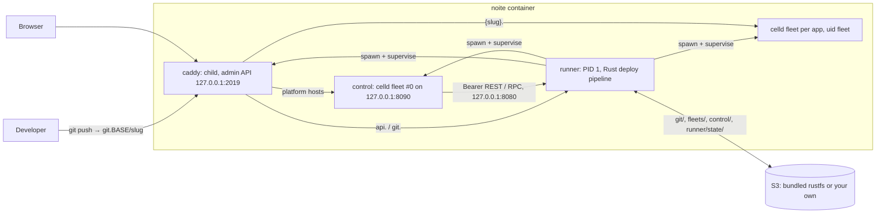

# Noite: tiny self-hostable celld PaaS

Status (2026-09-27): one image, tenant isolation, bucket-held runner state, graceful shutdown and readiness are implemented and verified (`cargo build --release`, `cargo test`, `clippy -D warnings`, `bun run check`, `make e2e`, `make e2e-isolation`, the dev overlay). Scoped per-app credentials are scaffolded; no provider mints them yet. There is no v1 compatibility and no migration path: installs from before 2026-09-27 are wiped and reinstalled.

Noite's promise is "your own tiny Cloudflare Workers": a person runs one install, and other people push code to it. That makes tenant code **untrusted**, and it makes the install something people deploy on Compose, Railway, Coolify or a VM with minimal effort. This file is the record of the current system: the locked decisions first, then how each part works, then what is left, then history.

## Decisions (locked)

- **Product:** full tiny PaaS — user accounts, apps, subdomains, thin deploy/build logs + status.
- **Tenancy:** one operator per install; no orgs; users own apps; per-app collaborators (`view` / `push` / `admin`). `NOITE_TENANCY=multi` (the default off `localhost`) treats pushed code as untrusted and sandboxes it; `single` means only the operator pushes code.
- **One image:** `ghcr.io/<owner>/noite`. `tini` → the Rust runner as PID 1, which supervises Caddy, the control UI and every tenant fleet. Every platform deploys the same image.
- **Control plane:** **Oxide Worker UI** (`apps/noite`, `preset: worker` — workflows/queues/cron, D1 auth DB) served as celld fleet #0, plus the **Rust runner** (`apps/runner`; a Rust binary can't be a worker), which owns deploys, fleets, routing and the edge config.
- **Tenant runtime:** each app is its own celld fleet (its own bucket prefix and process).
- **Source:** stock Git smart-HTTP at `http://git.$BASE_DOMAIN/{slug}` (Basic `git` / profile API key; collaborator `view`/`push`) → runner writes tip `s3://noite/git/{slug}/refs/heads/main/{sha}.bundle` + a `MANIFEST.json` linearization point.
- **Deploy:** push to `main` (and/or tip poll / webhook) → bare mirror + checkout → build → `celld deploy` → reload.
- **Isolation:** one app = one fleet; never share `deploy/current.json`.
- **Edge:** Caddy inside the image — per-host on-demand TLS (ask-gated at `/v1/edge/tls-ask`), Host routing to the control UI (`CONTROL_SUBDOMAIN=app` in prod, bare domain in dev), `api.`/`git.` → runner, `{app}.$BASE_DOMAIN` → the app's fleet (`app`/`api`/`git` slugs reserved). Behind a terminating proxy (Coolify/Traefik TCP-forwarding SNI, Railway) our Caddy still issues per-host certs on demand where the proxy passes TLS through, and serves plaintext `:80` where it does not.
- **State:** one S3 bucket holds everything durable; the `/data` volume is a cache the runner can rebuild from it.
- **Effect:** prefer `Effect` / `Config` / `Schedule` / `Schema` / `HttpClient` / `Layer` over ad-hoc async.

## Architecture


```mermaid
flowchart LR
  dev[Developer] -->|git push → git.BASE/slug| edge
  user[Browser] --> edge
  subgraph noite[noite container]
    runner[runner: PID 1, Rust deploy pipeline]
    edge[caddy: child, admin API 127.0.0.1:2019]
    control[control: celld fleet #0 on 127.0.0.1:8090]
    fleet[celld fleet per app, uid fleet]
    runner -->|spawn + supervise| edge
    runner -->|spawn + supervise| control
    runner -->|spawn + supervise| fleet
    edge -->|platform hosts| control
    edge -->|api. / git.| runner
    edge -->|"{slug}."| fleet
    control -->|Bearer REST / RPC, 127.0.0.1:8080| runner
  end
  runner <-->|git/, fleets/, control/, runner/state/| s3[(S3: bundled rustfs or your own)]
```

### Process tree

```
tini (PID 1: reaps zombies, forwards signals)
└── noite-runner                      root; API on :8080
    ├── caddy run --watch             :80/:443, admin 127.0.0.1:2019
    ├── celld  control fleet #0       public 127.0.0.1:8090, internal 0.0.0.0:8091
    ├── celld  tenant fleet × N       uid fleet (10020); public 0.0.0.0:{p}, internal 127.0.0.1:{p+1}
    └── bun / sh                      builds and release, uid build (10010), transient
```

- The runner owns every child's lifecycle (`host/children.rs`: restart with 1–30 s backoff; SIGTERM, then SIGKILL past the budget). There is no second supervisor and no shell entrypoint.
- The runner stays root: it needs `setuid`, `chown` and `nft`. Its children are the privilege boundary.

### Ports

- Published: `:80`/`:443` (host `HTTP_PORT`/`HTTPS_PORT`, default 9080/9443). `:8080` (runner API) is published only by the e2e lane.
- Fleet ports: two per app from `NOITE_FLEET_PORTS` (default `20000-29999`), allocated by `db::next_ports`; exhaustion errors instead of wandering into ephemeral ports.

### Bucket and volume

- `s3://noite/git/{slug}/` — tip bundles from Git HTTP + `MANIFEST.json` (`{seq, refs}`; readers resolve refs from the manifest so half-written pushes stay invisible).
- `s3://noite/fleets/{slug}/` — tenant celld (deploys, storage, telemetry).
- `s3://noite/control/` — the UI worker bundle + its D1 (accounts, invites).
- `s3://noite/runner/state/` — runner SQLite snapshots + the `owner.json` fence.
- The runner ensures bucket `NOITE_S3_BUCKET` (default `noite`) on boot, enables versioning best-effort, and uses root keys for deploy/reconcile (see [Scoped credentials](#scoped-credentials)).
- `/data` (volume `noite-data`): the live runner SQLite, git mirrors, builds, fleet working dirs, the control node's working dir, Caddy config and certificates. Everything in it is rebuildable from the bucket (certificates are re-issued).

### Image

`docker/Dockerfile` is the only Dockerfile. Stages: `celld` (pinned `CELLD_VERSION`), `runner-build`, `ui-build`, `base` (bun on Debian + the `node` binary `NODE_VERSION` + `tini`, `ca-certificates`, `curl`, `git`, `awscli`, `nftables`, sidecars from `docker/install-sidecars.sh`, Caddy `CADDY_VERSION`, users `build`/`fleet`), `dev`, and `noite` (the default last stage: runner binary + `/opt/noite/control/dist`). `docker/check-versions.ts` asserts each pin appears exactly once and that the access-log path matches the runner's default. `awscli` stays for release commands and debugging. CI builds `noite` for amd64 and arm64 on native runners and merges the digests (`.github/workflows/images.yml`).

## Tenant isolation

celld's internal listener carries peer traffic and an **unauthenticated operator API** (`POST /shutdown`, `POST /reload`, `POST /rebalance/pause`, `GET /state`); celld's security model assumes a trusted private network protects it. Noite runs untrusted Worker code in the same container, so the platform closes that network to tenant code itself.

### Tenancy mode

`NOITE_TENANCY=single|multi` (default `multi` when `BASE_DOMAIN` is not `localhost`, else `single`). `host/isolation.rs::self_check` runs at boot: build uid drop, fleet uid drop, nft table installed.

- `multi`: any failed check keeps `/ready` at 503 with the reason and refuses builds.
- `single`: checks run and warn, nothing is refused; fleets and release commands use the root bucket keys, and no egress policy is installed.

This is the honest contract for platforms that cannot provide isolation: they run Noite for one person.

### Build and release sandbox

- `cmd::run_sandboxed` starts from `env_clear()`, adds `base_env` (`PATH`, `HOME=/home/build`, `TMPDIR`, `LANG=C.UTF-8`, `CI=1`, `NODE_ENV=production`, `BUN_INSTALL_CACHE_DIR`) and the tenant's vars, drops to uid `build` in `multi`, runs in its own process group, and `killpg`s the group after every step. `run_cmd` (runner-owned tools: `git`, `celld deploy`, `aws`, `duckdb`) clears the environment too.
- Tenant vars never carry platform names: `db::env_reserved` drops `PORT`, `HOST`, `AWS_*`, `S3_*`, `CELLD_*`, `RUNNER_*`, `NOITE_*`, `BETTER_AUTH_*`, `CADDY_*`, `LD_*`, `NODE_OPTIONS` and `BUN_*` (except the cache var).
- Bounds: `bun install` and `bun run build` 300 s each, the `cloudflare.config.ts` conversion 60 s, release 600 s; `RLIMIT_NPROC` (only when dropping uid) and `RLIMIT_FSIZE`; a worktree above `RUNNER_BUILD_MAX_MB` (2048) fails the deploy.
- Worktrees are `lchown`ed to the build uid (never following symlinks) and taken back after the build. `builds/<slug>` is 0755 so bun can resolve its cwd.
- **Release** (`release` in the tenant's `wrangler.jsonc`, meant for migrations) runs in `multi` only with scoped bucket keys, so it is **skipped** there until a credential provider lands, with a deploy-log line saying so. In `single` it runs with the root keys. Noite's `release` key is stripped from `wrangler.json` before `celld deploy` (celld rejects unknown keys).
- Build network stays open (package registries); the egress policy below applies to the build uid as well.

### Egress policy

`host/netisolation.rs` installs one nft table in `multi` (it needs `CAP_NET_ADMIN`). For the build and fleet uids, in order:

1. accept `ct state established,related` (without it, replies on connections the runner itself opened were rejected);
2. accept DNS (udp/tcp 53);
3. accept the storage endpoint, for the fleet uid only: the addresses `S3_ENDPOINT` resolves to, on its port, refreshed every 30 s (a fleet's celld needs its bucket, and bundled RustFS sits on a private address);
4. reject loopback (`127.0.0.0/8`, `::1`), RFC 1918, link-local and metadata (`169.254.0.0/16`), CGNAT (`100.64.0.0/10`), and ULA/link-local IPv6 (`fc00::/7`, `fe80::/10`).

Since all fleets share one uid, "the fleet uid may not dial loopback" blocks fleet → fleet, fleet → operator API, fleet → runner and fleet → Caddy admin. A single-node fleet never needs to dial loopback: Caddy dials the fleet, not the reverse. The same rules, loopback included, apply to builds. Tenant fleets additionally bind their internal listener to loopback. The control node's internal listener binds `0.0.0.0:8091` so a replacement node can reach it during an overlapping redeploy; the policy, not the bind, keeps tenants off it.

Fallback where a platform grants no `NET_ADMIN` (not built): run each fleet under `bwrap --unshare-net` with `pasta`/`slirp4netns` for internet-only egress. Upstream requests worth filing with celld: an auth token for the operator API, and an outbound policy for the main Worker.

### Data directory

`isolation::harden_data_dir` runs first at boot: the runner sets umask 077, `/data`, the work dir, `builds` and `fleets` are 0755 for traversal, every other entry is 0700/0600, and the SQLite files (`-wal`, `-shm` included) are 0600. The hostile suite found the gap that motivated it: the build uid could read `noite.sqlite`.

### Hostile-tenant suite

`apps/noite/test/hostile/` is a sample app whose Worker, build script and release script attempt each attack and report JSON; `apps/noite/e2e/hostile.spec.ts` asserts every attempt failed. It runs in `make e2e-isolation` (`NOITE_TENANCY=multi`, `E2E_HOSTILE=1`) and is skipped otherwise.

| Probe | Where | Must |
| --- | --- | --- |
| `process.env` / `/proc/self/environ` for `RUNNER_TOKEN`, `AWS_SECRET_ACCESS_KEY`, `BETTER_AUTH_SECRET` | build, release | none present |
| read `/data/noite.sqlite`, git mirrors | build | EACCES |
| a neighbour's internal `/state`, `POST /shutdown` | Worker | refused |
| the runner on `127.0.0.1:8080`, the control node on `:8091` | Worker, build | refused |
| the object store root | Worker | refused or 401/403 (reachable by design, holds no keys) |
| `169.254.169.254` | Worker, build | refused |
| `https://example.com/` | Worker | succeeds |
| the neighbour app still serves afterwards | lane | 200 |

### Known limits

- The build uid is **shared**, so two concurrent builds can read each other's worktrees. Acceptable while tenants are untrusted rather than adversarial; per-build uids are the fix.
- Fleets hold the **root** bucket keys until [Scoped credentials](#scoped-credentials) land, so a compromised fleet process can reach every prefix.
- Worker code can reach the object store's unauthenticated surface (it answers 401/403).
- Sandbox depth is uid + env + rlimits + egress rules. A container per build (rootless Podman in the image, gVisor) is out of scope unless tenants are expected to be adversarial.
- No per-tenant memory containment: fleets share the container cgroup, so one fleet's growth pushes every fleet toward the shared shed threshold. Per-fleet cgroups (memory.max per fleet, which also gives celld a per-fleet working set) are the fix where cgroupfs is writable.
- Railway does not grant `NET_ADMIN` (verified 2026-09-27: `nft` fails with `Operation not permitted`), so Railway installs run `NOITE_TENANCY=single`. Railway also wraps the entrypoint, so tini is not PID 1 there; set `TINI_SUBREAPER=1`.

## Control UI (fleet #0)

`host/control.rs` deploys and `main.rs::supervise_control` runs the control worker as a reserved fleet:

1. Wait for the bucket (`ensure_buckets`, with RustFS status diagnostics).
2. Build the worker's vars from the runner's config (`CONTROL_PASSTHROUGH`: `BETTER_AUTH_SECRET`, `NOITE_ADMIN_EMAIL`, `NOITE_AUTH_RATE_LIMIT`, `NOITE_EMAIL_WEBHOOK_URL`, `NOITE_RATE_LIMIT_RPM`, `NOITE_SMTP_FROM`, plus the URLs), dropping empty values.
3. Revision = hash of the bundle's `REVISION` and the vars; if it differs from the marker in the bucket, write `wrangler.json` into a temp copy of `/opt/noite/control/dist`, `celld deploy` it to `s3://{bucket}/control`, then store the marker. A restart with the same bundle and vars deploys nothing.
4. Spawn celld with `--listen 127.0.0.1:8090 --internal-listen 0.0.0.0:8091 --advertise <CELLD_ADVERTISE | RAILWAY_PRIVATE_DOMAIN | /etc/hostname>:8091`, `CELLD_TRUST_FORWARDED_HEADERS=1`, `CELLD_WATCH=/data/control`, `CELLD_READY_FLEET_GATE_MS=15000`, `CELLD_DURABILITY=bucket` and `CELLD_SHUTDOWN_TOTAL_MS` inside the stop budget.

The worker reaches the runner at `http://127.0.0.1:8080`. When the image has no bundle (the `dev` target), the runner skips the control child and `vite dev` serves the UI on the same address.

## Edge

- Caddy is a runner child (`--watch` on `/data/caddy/Caddyfile`, admin on `127.0.0.1:2019`). `host/caddy.rs` generates Caddyfile text (the generator and its tests are unchanged), writes it only when it changed, and `POST`s it to the admin `/load`; a rejected config is logged with Caddy's error and surfaced in `/ready`, and the previous config keeps serving. Admin connection errors during Caddy's own startup are debug-level.
- Upstreams are loopback: control `127.0.0.1:8090`, `api.`/`git.` `127.0.0.1:8080`, tenants `127.0.0.1:{port}`.
- Every site carries `encode zstd gzip` (celld does not compress; `text/event-stream` stays uncompressed and unbuffered) and a 30 s `response_header_timeout`.
- Tenant and custom-domain sites are **gated on fleet readiness** (`caddy.rs::TENANT_PROXY`): Caddy health-checks `/.well-known/celld/health` (503 until celld's ready gate opens) on load and every second, holds a request up to 20 s (`lb_try_duration`) while the fleet is not ready, and otherwise serves a self-refreshing "starting" page with 503 + `Retry-After: 5` (`TENANT_STARTING`, `handle_errors 502 503`). A ready fleet is proxied with no added wait; a held request is never sent, so POSTs are safe. celld's own 503s (load shedding) pass through.
- Access log at `/data/caddy/access.log` (one constant, `CADDY_ACCESS_LOG`); Caddy does not roll it, the tailer (`host/accesslog.rs`) truncates after reading. Metrics do **not** come from it.
- On-demand TLS is ask-gated at `/v1/edge/tls-ask`: a certificate is minted only for a platform host or a live tenant/custom host. `CADDY_AUTO_HTTPS=off` behind a terminating proxy serves plaintext `:80`.
- Scheme is pinned per host on plaintext twins (`caddy.rs::plaintext_hosts`): Caddy applies an address line's scheme to the first address only, so `http://app.x, extra.x` once bound the extra host on `:443` and made the whole config unadaptable (`ambiguous site definition`). Regression tests: `plaintext_twin_pins_the_scheme_per_host`, `behind_proxy_extra_control_host_keeps_a_valid_twin`.

## Runner state

`host/state.rs` makes the volume a cache:

- **Write path:** a task polls `PRAGMA data_version` every 2 s; after a change it waits for 10 s of quiet and at most one upload a minute, then `VACUUM INTO` a temp file and uploads `runner/state/noite.sqlite`. Also on graceful shutdown and on `POST /v1/admin/snapshot`. The loss window on an ungraceful crash is therefore about 70 s of API mutations. Everything else is reconstructible: git mirrors from tip bundles (`host/rehydrate.rs`), fleets from the bucket, telemetry from Parquet.
- **Single writer:** `claim()` writes `runner/state/owner.json` at boot and every upload re-checks it first (`still_owner`), so a replaced runner stops uploading instead of overwriting its successor. This is a fence rather than an `If-Match` conditional write because not every S3 store supports those.
- **Boot path:** if the local database is missing, download the snapshot into `.restoring` and rename it into place before `db::connect`. Not-found starts fresh; any other error is retried and then **fails the boot**, because an empty database would overwrite the good snapshot. A local file always wins over the bucket (only local state is ever uploaded).
- Litestream was considered: a smaller loss window for a sidecar and a second config surface. Revisit if operators report lost mutations.

## Shutdown

On SIGTERM/SIGINT the API stops accepting, the reconcile loop stops spawning, and `supervisor::stop_all` signals every tenant fleet and the control node at once (`libc::kill`), waiting under one budget `NOITE_STOP_BUDGET_MS` (25000; each celld gets a `CELLD_SHUTDOWN_TOTAL_MS` below it so it seals its node log inside ours). Survivors get SIGKILL. Then Caddy stops (5 s), last, so in-flight requests drain through it, and then the final state snapshot is written. Compose sets `stop_grace_period: 35s`; Railway needs `RAILWAY_DEPLOYMENT_DRAINING_SECONDS=35`. A single fleet stop (`stop_fleet`) waits 15 s before SIGKILL.

## Readiness

`GET /ready` answers 200 only when all hold, else 503 with `{"ok":false,"failing":[…]}`: first reconcile done (`reconcile`); the bucket answers (`bucket: …`, cached briefly); `multi` isolation checks passed (`isolation: …`); the control fleet is healthy when the image has a bundle (`control: …`); Caddy accepted the last config (`caddy: …`). It is the container healthcheck and what `make doctor` prints. One check fits Compose, Railway, Coolify and Fly.

## Scoped credentials

Goal: a compromise of one fleet reaches one app.

Built (`host/credentials.rs`, table `app_credential`): rows are AES-256-GCM with a random nonce and the app id as associated data, under a key derived from `RUNNER_TOKEN` with HKDF, so the snapshot in the bucket is not a key dump and a row cannot be replayed onto another app. Lookups: `scoped_credentials` (the decrypted row or nothing), `tenant_process_credentials` (scoped, else root in `single` only; used by release), `fleet_credentials` (scoped, else root). `mint` refuses to store root keys. No provider mints keys yet, so fleets run with root keys.

To build: a `CredentialProvider` (`app_credentials(slug)`, `revoke(slug)`), keys minted at app create, rotated on rename, revoked on delete (`host/purge.rs`), used by fleet spawn, release and the D1 storage browser.

| Store | Mechanism | Status |
| --- | --- | --- |
| RustFS | IAM user + policy on `arn:aws:s3:::{bucket}/fleets/{slug}/*` via its admin API | verify support at the pinned version |
| MinIO | same, admin API user + policy | supported |
| AWS S3 | IAM user or STS `AssumeRole` with a prefix-scoped session policy | supported |
| Cloudflare R2 | tokens scope to buckets: bucket-per-app (`noite-{slug}`) via the Cloudflare API | optional provider; changes the bucket layout on R2 |
| Tigris | per-bucket keys; bucket-per-app like R2 | verify |
| none of these | root keys | `single` only |

celld's storage contract (conditional writes, read-after-write, ranged reads) must hold under the scoped keys; celld's startup check fails loudly when a policy blocks a required call. Order: MinIO/S3 first, RustFS after verification, R2 last. Done when fleet keys fail `ListObjectsV2` outside `fleets/{slug}/`, release migrations work with them, and purge revokes them.

## Configuration

`config.rs` is the single source of truth: one struct, defaults in one place, and no aliases (every variable has exactly one name). `Config::validate` fails the boot with a list of problems: the dev `RUNNER_TOKEN`, dev `BETTER_AUTH_SECRET` (`dev-` prefix) or the compose-default S3 keys on a non-`localhost` `BASE_DOMAIN`; a `BETTER_AUTH_URL` host the edge does not serve as a control host; a bad `NOITE_FLEET_PORTS` range; a stop budget under 5 s; on Railway, a draining window shorter than the stop budget. The worker refuses default secrets off-localhost on its own too (`auth.ts::defaultSecretRefusal`). `.env.example` documents every variable and `docker/compose.yaml` gives each a default.

## Install targets

Operator guide: `apps/website/docs/deployment.mdx`.

- **Compose:** `docker/compose.yaml` is the whole install: one `noite` service (image `${NOITE_IMAGE:-ghcr.io/ryuzcorp/noite:latest}`, `cap_add: NET_ADMIN, SETUID, SETGID, CHOWN`, volume `noite-data:/data`, healthcheck `/ready`, stop grace 35 s) and `rustfs` (1.0.0, API on loopback). `noite` depends on `rustfs` with `required: false`, so BYO S3 is `--scale rustfs=0` plus `S3_ENDPOINT` and keys. Every variable is defaulted, so the file boots as-is from a store or panel. Overlays: `compose.build.yaml` (build from the tree: `make up`), `compose.dev.yaml` (the `dev` target with sources bind-mounted: `make dev`), `compose.e2e.yaml` (the test lane).
- **Coolify:** the same file; the Traefik TCP router for `*.<domain>` SNI passthrough is a label on `noite`, and domains go on the `noite` service (`SERVICE_URL_NOITE_80`).
- **Railway:** one service from the image, one volume at `/data`, R2/Tigris or a `rustfs` service. Domain target port 80, `CADDY_AUTO_HTTPS=off` (Railway terminates TLS; one `*.<domain>` custom domain covers every host), `RAILWAY_DEPLOYMENT_DRAINING_SECONDS=35`, and `PORT=8080` + path `/ready` + `RAILWAY_HEALTHCHECK_TIMEOUT_SEC=600` for a healthcheck (Railway probes `PORT`; the runner never reads it).
- **Dev:** `docker/dev.sh` runs the runner under cargo-watch and `vite dev` on `127.0.0.1:8090`. `celld dev` cannot serve the UI (raw esbuild cannot resolve Oxide's `virtual:oxide/worker`), the one deliberate divergence from celld's documented dev flow.
- **E2E:** `make e2e` builds the image (or `TAG=<sha>` pulls it), boots it as project `noite-e2e` with its own bucket and ports (UI :8090 through Caddy, API :8080, tenants 20000+, rustfs :19000), resets containers and volumes by label and name (podman-compose's `down -v` aborts on the first missing container), runs doctor and Playwright. `make e2e-isolation` = the same in `multi` plus the hostile suite. `E2E_KEEP=1` leaves the stack up.
- **Backup:** `make backup` snapshots the runner, stops the stack, tars `noite-data` and `rustfs-data` with a `MANIFEST`, starts again. `make restore FROM=…` is destructive. With your own bucket, use provider versioning.
- **Updates** restart the runner and every fleet with it (cold boots). Pin `NOITE_IMAGE` to a SHA tag and batch upgrades.

## Deploy pipeline and Git

- Trigger: push fast-path (spawn after receive-pack), reconcile poll of `MANIFEST.json` + the main tip bundle, and a bearer-gated `/webhook` nudge. RustFS notifications stay off (they cannot carry a bearer).
- Pipeline: tip `.bundle` → bare mirror `repos/{slug}.git` + worktree → sandboxed `bun install` / `bun run build` when declared → `cloudflare.config.ts` conversion when the tree has no Wrangler config → optional release → strip Noite keys → `celld deploy` → spawn or `POST /reload` on the fleet's internal listener. A failed release keeps the old deployment serving. Deploy logs keep a 64 KB tail.
- **`cf` CLI config.** An app may declare its Worker in `cloudflare.config.ts` (the `cf` CLI's config) instead of `wrangler.json(c)`. When neither the root nor `dist/` has a Wrangler config after the build, the runner runs `host/cf-config.mjs` with `node` in the build sandbox: `@cloudflare/config` (from the app's own `cf` dependency) loads the config and converts it with `convertToWranglerConfig`, and the script writes `wrangler.json`. Node, not Bun: the loader needs Node's module hooks and refuses Bun. celld 0.6 rejects the new `exports` key, so created Durable Objects become one `v1` migration (`new_sqlite_classes` / `new_classes`); deleted, renamed and transferred classes and other export kinds fail the deploy. `secrets` is dropped (app env vars fill that role), a D1 binding without an id uses its name, and a DO binding to the app's own class loses `script_name`. The `cf` config has no D1 migrations directory and no `release`.
- The config `celld deploy` uploaded is stored as JSON in `app.deployed_config`; the storage views read it first and fall back to the Wrangler file in the pushed source.
- Rollback: `POST /v1/apps/{id}/rollback {sha}` redeploys a past successful sha (bundles are immutable per sha); the UI offers it on success rows.
- Tenant env: `app_env` + `/v1/apps/{id}/env` (admin-gated writes), injected into build, release and fleet env minus the reserved names; `.dev.vars` download in settings.
- Git hardening: `MANIFEST.json` linearization per slug, receive-pack head parsing, per-role push policy (`push` = create + fast-forward only, `admin` = anything), per-slug push mutex, manifest re-apply on reads (`git_policy.rs`, `git_manifest.rs`). Git keys must sit under `git/`, and a manifest read error other than not-found is an error, not an empty repo.
- Auth: profile API keys (Better Auth); the runner verifies via the UI's `/internal/git-auth` and the collaborator role (`view` fetch, `push` receive).
- CLI (`packages/cli`, `@noitenow/cli`, publishable): `noite deploy` pushes a CI-built dist + `wrangler.jsonc` as a synthetic fast-forward commit over Git HTTP; reads `GITHUB_*`, writes `$GITHUB_OUTPUT`, comments on PRs via `gh`.

## Features

### Source preview

Runner endpoints (`host/source.rs`) serve from the bare mirror at `last_deploy_sha` else HEAD: `GET /v1/apps/{id}/tree`, `/blob/{*path}` (256 KB cap, binary detect), `/diff` (parent diff, `--root` for the first push, 1 MB cap). UI actions `sourceTree`/`sourceBlob`/`sourceDiff` (ownership-gated) feed `/apps/[id]/source`: `@pierre/trees` `FileTree` and `@pierre/diffs` `File`/`FileDiff`, mounted imperatively inside `watch.once()` with dynamic `import()` so SSR stays clean. Not done: `loadDiffFiles` hydration (needs a rev on the blob endpoint), per-file permalinks.

### Observability (the pricing substrate)

- Fleets run `CELLD_OTEL=1` with the bucket sink (Parquet under `fleets/{slug}/telemetry/{traces,logs}/`), `CELLD_OTEL_FLUSH_MS=5000`, `CELLD_OTEL_RETENTION=14d`. No collector.
- The runner aggregates with the DuckDB CLI into `app_metric` minute buckets (upsert-accumulate, 14-day prune). The window stops 10 s behind now so every bucket it names has closed; globs are day-scoped; the watermark persists in SQLite, so restarts never double-count.
- Requests = `celld.fetch` spans (verified 1:1 against traffic); errors = the `ok` flag; latency and queue = `duration_us` / `queue_wait_us`; CPU = `/proc` sampling of the celld subtree (OTel has no CPU signal).
- Compaction (celld never compacts its own files): hourly, for the hour just ended, per node directory, one DuckDB `COPY … compacted.parquet (zstd)` ordered by `start_unix_us`; sources are deleted only after `head-object` proves the output exists; `union_by_name=true` survives schema changes (celld calls the schema `v0-unstable`).
- API/UI: `GET /v1/apps/{id}/metrics?hours=24` and on-demand `/spans?hours=1`; `MetricsCard` shows 24 × 1 h bars and a spans table.
- Pricing (not built): bill on requests + `duration_us` and/or CPU ms.

### Invite-only registration

The worker D1 has an `invite` table (`code`, `createdBy`, `usedBy`, `usedAt`, `revoked`, `note`, `createdAt`); `lib/invites.server.ts` owns mint/redeem/list. The first account registers with no code and becomes `admin`; every later one needs a single-use code (12 characters, unambiguous alphabet, `ABCD-EFGH-JKLM`). Redemption is one `UPDATE … WHERE usedBy IS NULL AND revoked = 0`, so one code admits one account. Each new account gets `INVITES_PER_USER = 2` codes. Members see theirs on `/account`; admins mint 1–50 and revoke in `/god-mode`; the signup form shows the field once `GET /api/invite/status` says the instance is past its first account. It lives in the worker because accounts do; the runner never sees registration.

### Custom domains

`app_domain` (hostname PRIMARY KEY: one app per hostname) with `GET/POST /v1/apps/{id}/domains`, `DELETE …/domains/{hostname}` and RPC `domains.list|add|remove`. `lifecycle.rs::hostname_ok` validates (lowercase DNS shape, ≥ 2 labels, no wildcard/IP/port/path); platform hostnames and `CONTROL_EXTRA_HOSTS` are refused, a taken hostname is 409. Routed and certified only while the app is deployed and running; the fallback page resolves custom hosts too. No DNS/TXT ownership check yet.

### Limits

- `RUNNER_MAX_APPS_PER_USER` (10), enforced in the runner on `apps.create`, so API keys cannot bypass it.
- `RUNNER_FLEET_MAX_RSS_MB` (0 = unset: celld's default, 80% of the container's memory) → `CELLD_MAX_RSS_MB`, set on a fleet only when non-zero. celld applies it to the greater of its own RSS and the **cgroup working set**, and every fleet shares the container's cgroup, so it is a container-wide shed threshold (503 + `Retry-After` instead of the container OOM-ing), not a per-tenant cap. The old default of 512 closed every fleet's ready gate (`memory_headroom=false`) and refused cells with `CapacityExhausted` once the container as a whole passed 512 MB: permanently in dev (vite + workerd ≈ 2.7 GB), and while the control fleet booted in prod (fixed 2026-09-28); `RUNNER_FLEET_IDLE_EVICT_S` (120) → `CELLD_IDLE_EVICT_S`; `RUNNER_FLEET_ASSET_CACHE_MB` (64) → `CELLD_ASSET_CACHE_BYTES` per fleet.
- `RUNNER_FLEET_LOG` (`error,celld=warn`) → the fleet's `RUST_LOG`, so celld's warnings reach the per-app log view.
- Rate limits: better-auth's per-client budget for `/api/auth/*` (`NOITE_AUTH_RATE_LIMIT`, 600/min, keyed on the forwarded client address) and a worker limiter per route class `auth`/`invite` (`NOITE_RATE_LIMIT_RPM`, 600/min, 429 + `Retry-After` before better-auth or D1). `0` disables either. The raw-port e2e lane raises both.

### Scale to zero (idle sleep)

An app with no requests for a day stops costing anything, and the next request brings it back without the visitor noticing.

- **Sleep sweep.** A scheduled job in the runner (`host/sleep.rs`, every `RUNNER_SLEEP_SWEEP_S`, default 3600 s) puts an app to sleep when all of these hold:
  - it is deployed, desired `running` and awake;
  - it has no request in the last `RUNNER_SLEEP_AFTER_H` hours (default 24; `0` disables the feature).
- **What counts as activity.** Activity is the newest of:
  - the last minute bucket with requests in `metrics.app_metric` (celld `celld.fetch` spans, i.e. real requests);
  - the app's last wake (`app.woke_at`);
  - its last deploy. So a fresh deploy or a manual start gets a full window before it can sleep.
- **Asleep is not stopped.** `desired_state` stays `running` (the owner's intent). Sleep is its own column, `app.asleep_since` (added with `db::ensure_column`), and `status` reads `sleeping` for the UI. A stopped app never sleeps or wakes, and stopping an asleep app clears the flag.
- **Going to sleep** (per-app transition lock), in this order:
  1. mark the app asleep;
  2. rewrite the Caddyfile so its sites wake on demand;
  3. stop the fleet with the normal SIGTERM drain. A request that arrives mid-transition therefore already takes the wake path.
- **Waking is invisible.** An asleep app's tenant and custom-domain sites keep routing to its port, preceded by `forward_auth` to the runner's `GET /v1/edge/wake`. Caddy holds the original request, body included, while the subrequest runs. The runner:
  1. resolves the app from `X-Forwarded-Host` (tenant slug or custom domain, as `edge_fallback` does);
  2. clears the flag and sets `woke_at`;
  3. spawns the fleet immediately;
  4. waits until `/.well-known/celld/health` answers 200, bounded by `RUNNER_WAKE_TIMEOUT_S`, default 120 s, which covers celld's ready gate;
  5. rewrites the Caddyfile back to the plain proxy;
  6. answers 200. Caddy then proxies the held request as if the app had never slept. There is no "starting" page: concurrent requests wait on the same wake (per-app lock), and only a failed wake answers an error (503).
- **What else counts as activity.** A deploy of an asleep app (push, rollback, web commit) wakes it first. TLS ask treats an asleep app as live, so custom-domain certificates keep renewing.
- **Cost of the choice.** The first request after a quiet day waits for a cold fleet start: celld boot plus its ready gate, typically a few seconds. Everything after it is unaffected.

### Runner schema evolution

One idempotent `apps/runner/schema.sql`, embedded and applied every boot: no migration ledger. New tables go in it with `CREATE … IF NOT EXISTS`; new columns on existing tables go through `db::ensure_column` (SQLite has no `ADD COLUMN IF NOT EXISTS`).

## celld alignment

The docs at https://celld.dev/docs/ are the source of truth. What Noite relies on:

- **Tenant fleets:** `--bucket s3://<bucket>/fleets/<slug> --endpoint … --region … --listen 0.0.0.0:<p> --internal-listen 127.0.0.1:<p+1> --advertise 127.0.0.1:<p+1>`, `CELLD_WATCH` under `/data/fleets` (owned by the fleet uid), `CELLD_DURABILITY=bucket` (a single-node fleet has nobody to send to; the `fleet` posture needs two nodes before any proof completes), `CELLD_DEPLOY_POLL_S=5` (a push goes live faster; the runner also calls `POST /reload`), `CELLD_ESBUILD`, and the telemetry and limit settings above.
- **Control node:** see [Control UI](#control-ui-fleet-0). An explicit `--advertise` requires an explicit `--internal-listen`; the advertise must be peer-dialable, never loopback.
- **Removed variables** are rejected at startup (`CELLD_OTEL_SINK`, `CELLD_OUTPUT_GATE`, `CELLD_STORAGE_PROBE`, `CELLD_PACED_HANDOFF`, `CELLD_SHUTDOWN_DRAIN_MS`, …); Noite sets none.
- **Storage qualification:** celld qualifies S3, R2, GCS, Tigris and Azure Blob; the store must provide conditional writes, read-after-write and ranged reads, and celld checks the contract at node start. RustFS is **not** qualified: it passes celld's check and stays the zero-config default, but production should use a qualified store.
- **Assets:** only accepted top-level `wrangler` keys (unknown keys fail the deploy — hence stripping `release`); `assets` uses `directory`, `binding: ASSETS` (not auto-injected) and `not_found_handling: single-page-application`. celld serves assets with `max-age=0, must-revalidate`, so `apps/noite/public/_headers` marks `/assets/*` immutable for a year.
- **Operator surfaces:** `make doctor` checks `GET /.well-known/celld/health` on the control node and runs `celld diagnose --read-only --listen 127.0.0.1:0` inside the container (diagnose binds a listener of its own, and its default `:8080` is the runner's).
- **celld 0.6.0:** `compatibilityDate` is required (`2026-09-01` in `apps/noite/wrangler.jsonc`); no `export const` in a main module; wasm modules as `{ wasm: bytes }`; `transactionSync()` takes no callback; R2 keeps empty key segments distinct. Durable Object facets migrate to their own SQLite files on first open, which with `fleet` durability requires stopping the whole fleet first; every install path here replaces the node rather than overlapping two.

## Worker code rules

- **Nothing crosses requests.** No promise, timer or Effect runtime may be shared between requests unless it is registered with `ctx.waitUntil` or its waiters are time-bounded. celld drops a request's pending work when the request answers or its client leaves, and anything still waiting on that work hangs forever without an error.
- **Isolate-level setup runs once, concurrently-safe.** `ensureDb` (migrations, schema heal, backfills) is memoized behind an in-flight-aware promise (`apps/noite/src/lib/db.ts`); a request waits at most 5 s on a pass another request started, then runs its own. D1 work is bounded (setup 15 s, `withDb` 10 s).
- **Actions are bounded.** `actions.timeout: 15_000` in `apps/noite/vite.config.ts` answers a stuck action with a JSON-RPC error before the edge's 30 s timeout.
- **Do not write to a live D1 with the `celld d1` CLI.** In the lane, one `celld d1 execute` against the control node's D1 while the UI ran made every later page load hang. The D1 storage browser (`host/storage/d1.rs`) shells out the same way against a tenant's D1; check whether browsing a D1 stalls the app it inspects.

## Open questions and known issues

1. **Railway multi-tenancy:** `NET_ADMIN` is unavailable (verified 2026-09-27), so the nft egress policy cannot run there. Still open: probe `SETUID`/`SETGID`/`CHOWN` and unprivileged user namespaces, and decide whether a `bwrap` fallback is worth building or Railway stays `single` only.
2. **RustFS IAM:** if unsupported at the pinned version, bundled-RustFS installs stay on root keys, i.e. effectively `single`, unless the operator moves to MinIO/S3/R2.
3. **Snapshot loss window** (about 70 s) vs Litestream.
4. **Control and runner restart together** on every image update. Accepted: the UI cannot act without the runner, and one node removes the two-node readiness-gate drain that stalled the old topology.
5. **E2E comments** in `apps/noite/e2e/{helpers.ts,app-lifecycle.spec.ts,a-invite.spec.ts}` still call the app-detail and invite panels a known-broken surface; the stalls were fixed in oxidejs 0.5.6 (History, 2026-09-27), so those surfaces can now get UI-level coverage.
6. **Not built:** app-author docs ("your first app": `wrangler.jsonc` or `cloudflare.config.ts`, build/release scripts, env, `_headers`/`_redirects`, `deploy.sh`, logs/metrics) and a README for `apps/noite/test`; a tiny forge UI over bare mirrors (history, commit views); DNS/TXT verification for custom domains; pricing.

## Out of scope

Organizations and multi-host; deep APM; workloads that aren't celld apps.

## History

Condensed; git history has the detail.

- **2026-09-12 — plan waves.** Root `.dockerignore` (with `**/` patterns: a bare pattern matches the context root only, so `apps/runner/target` was in every build context); `make down` keeps data and `make nuke` wipes it (by name, since podman-compose's `down -v` aborts on the first missing container and left `409 slug already taken` behind); the pre-Oxide `_control` worker and the Bun host plane deleted; the runner as the Caddyfile's single owner; `/webhook` bearer-gated; default secrets refused off-localhost; deploy logs capped; Git auth on profile API keys. Oxide/Effect showcase code (schedules, queues, workflows, liveQuery) is kept deliberately.
- **2026-09-15/18 — container-cell topology.** The runner ran as a `RunnerContainer` Durable Object cell with a loopback S3 sidecar, a worker-relayed R2 durability relay and a static Caddyfile; the UI moved from a Bun server to the Oxide worker on a celld fleet (D1 fresh start, everyone re-registered).
- **2026-09-19 — features.** Release command + rollback, bucket versioning, tenant env, `make doctor`, the CLI.
- **2026-09-24 — revert to Compose.** The container-cell path (the DO, the sidecar, `/v1/sync/*`, the R2 relay, generated DO wiring) and the UI's D1 mirror of runner rows were deleted; Noite became four services (`rustfs`, `runner`, `control`, `caddy`) with a runner-written Caddyfile. The same day: celld alignment (telemetry flush + compaction, edge compression, asset caching, operator surfaces, storage qualification) and the alpha surfaces (invites, custom domains, limits, backup/restore, schema evolution, CLI publish fix).
- **2026-09-25 — installs.** A pull-only standalone Compose mirror for stores/VMs, and a Railway layout with an `edge` image (runner + Caddy) because Railway volumes cannot be shared between services. The `CONTROL_EXTRA_HOSTS` scheme bug (see [Edge](#edge)) was found there.
- **2026-09-26 — celld 0.6.0.**
- **2026-09-27 — control-node request stalls.** Page loads fanned out several `/__oxide/action` calls and the node answered one and stalled the rest (5 of 6 in a HAR; `N=2` ⇒ one 200, one 504 at 30 s). Two causes. (1) Minutes after a deploy that replaced every celld node, readiness waited for a drain (`ready_gate_expired reason=Drain`, then `ready_gate_open waited_ms=106010`), while a single-node replacement opened in about a second. (2) The steady-state cause was oxidejs on celld: celld's `node:process` answers unknown `process.versions` keys with a stub, so oxidejs detected a StackBlitz WebContainer and chained every action behind the previous one across requests; one cancelled link stalled the isolate until restart. Separately, the Effect RPC runtime oxidejs cached per isolate stalled under concurrency. A/B with 30 concurrent actions per round: 12–17 unanswered before, 30/30 (mean 0.02 s) after. Fixed in oxidejs 0.5.6 (version-string WebContainer detection, one RPC runtime per request on Worker hosts, no cross-request entry gate, `actions.timeout`). Ruled out by measurement: request handling, the runner hop, the store, node resources, the edge config.
- **2026-09-27 — one image, tenant isolation, no v1 compatibility.** Everything in this file above History. Deleted: `Dockerfile.runner`/`.ui`/`.edge`/`.runner-dev`/`.tools` and their ignores, both entrypoints, `runner-dev.sh`, `control-dev.sh`, `compose.byob.yaml`, `compose.standalone.yaml`, `check-standalone.ts`; the `noite-runner`/`noite-control`/`noite-edge` images; the `HOST_*`/`AGENT_*`/`CONTROL_URL`/`S3_BUCKET`/`PORT_BASE` aliases; the `app_secret` table, soft-delete reclaim, `git-remote-s3` bundle keys, the apikey backfill and `--print-env-example`. The one production install is wiped and reinstalled; a v1 bucket or volume is not read. The separate platform-v2 design spec was merged into this file.
