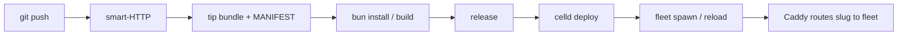

Noite is one image, `ghcr.io/ryuzcorp/noite`. The runner is PID 1 (under `tini`) and supervises every other process. State lives in one S3 bucket; the `/data` volume is a rebuildable cache.

## Process tree

```
tini (PID 1: reaps zombies, forwards signals)
└── noite-runner                      root; API on :8080
    ├── caddy run --watch             :80/:443, admin 127.0.0.1:2019
    ├── celld  control fleet #0       public 127.0.0.1:8090, internal 0.0.0.0:8091
    ├── celld  tenant fleet × N       uid fleet (10020); public 0.0.0.0:{p}, internal 127.0.0.1:{p+1}
    └── bun / sh                      builds and release, uid build (10010), transient
```

The runner owns every child's lifecycle: restart with 1–30 s backoff, SIGTERM then SIGKILL past the stop budget. There is no second supervisor.

## Ports

Published: `:80`/`:443` (host `HTTP_PORT`/`HTTPS_PORT`, default 9080/9443). `:8080` (runner API) is published only by the e2e lane. Each app takes two fleet ports from `NOITE_FLEET_PORTS` (default `20000-29999`); exhaustion errors instead of wandering into ephemeral ports.

The edge routes by Host: the control subdomain serves the UI, `api.`/`git.` reach the runner, `{slug}.<domain>` reaches the app's fleet.

## Bucket layout

Under `s3://<bucket>/`:

| Prefix | Holds |
| --- | --- |
| `git/{slug}/` | Tip bundles from Git HTTP plus a `MANIFEST.json` linearization point |
| `fleets/{slug}/` | Tenant celld state, deploys, and telemetry |
| `control/` | UI worker bundle plus its D1 (accounts, invites) |
| `runner/state/` | Runner SQLite snapshots plus the `owner.json` fence |

The bundled RustFS store provides this bucket with zero config; production uses a qualified store. See [Storage](/self-hosting/storage).

## A push, end to end

1. `git push` hits smart-HTTP at `git.<domain>/<slug>` (Basic `git` plus a profile API key).
2. receive-pack writes the tip as `refs/heads/main/<sha>.bundle` plus the `MANIFEST.json` linearization point, so half-written pushes stay invisible.
3. The runner checks out a worktree and runs sandboxed `bun install` / `bun run build` when declared. A `cloudflare.config.ts` is converted to Wrangler config when no Wrangler file exists.
4. The optional `release` command runs (migrations). Noite strips its own `release` key before deploying; celld rejects unknown keys.
5. `celld deploy` uploads, then the runner spawns the fleet or calls `POST /reload` on its internal listener.
6. Caddy routes `{slug}.<domain>` to the fleet's port. Deploy logs keep a 64 KB tail; a past successful `<sha>` redeploys via rollback.



Idle apps sleep and wake transparently; see [Observe](/apps/observe). Tenant isolation details live in [Tenancy](/self-hosting/tenancy).
